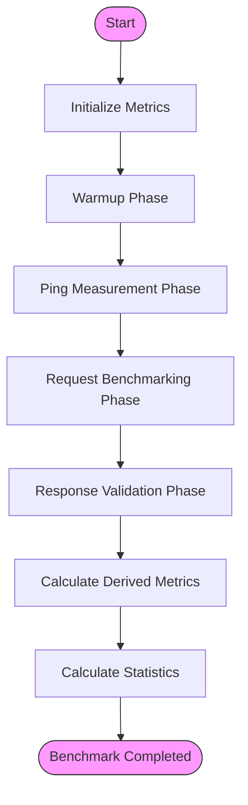
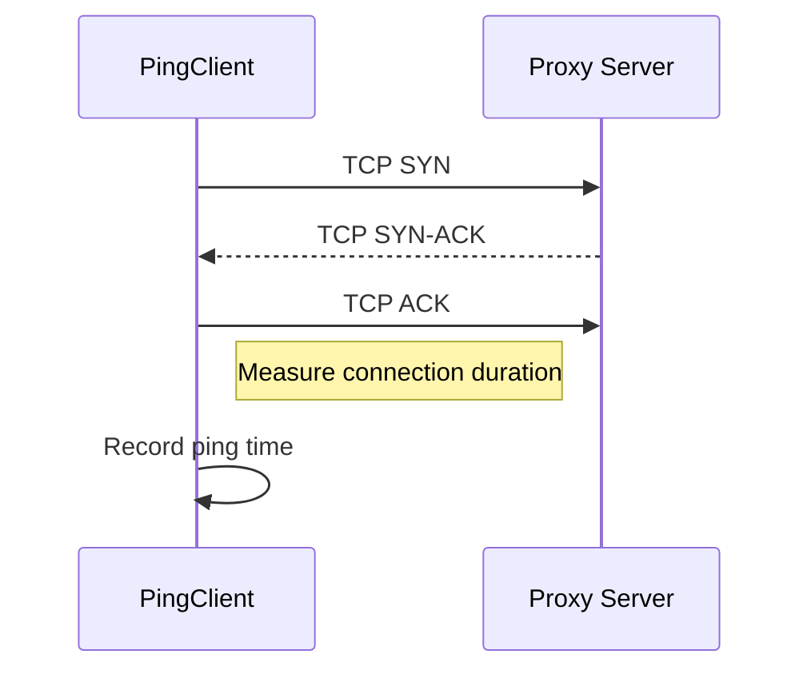
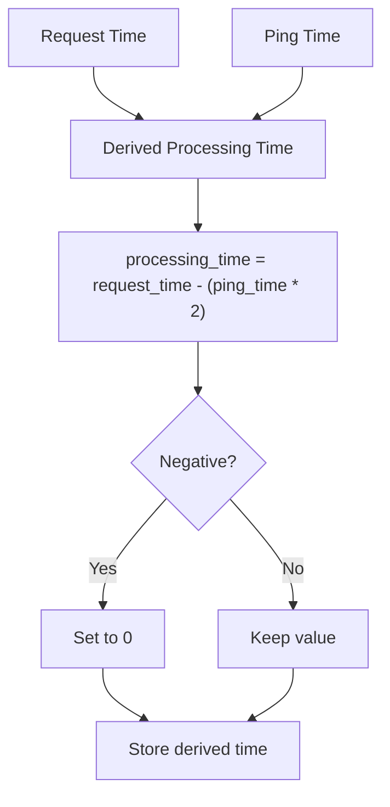
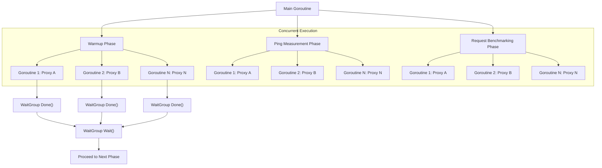

# Benchmarking Process

<cite>
**Referenced Files in This Document**   
- [benchmark.go](file://benchmark.go) - *Updated to include response validation and output features*
- [config.go](file://config.go) - *Added OutputResponse and ResponseValidation fields*
- [http_client.go](file://http_client.go) - *Modified for response handling*
- [socks5_client.go](file://socks5_client.go) - *Modified for response handling*
- [ping.go](file://ping.go)
- [metrics.go](file://metrics.go)
- [statistics.go](file://statistics.go)
</cite>

## Update Summary
**Changes Made**   
- Added new section on **Response Validation Phase** to reflect the integration of response validation functionality
- Enhanced **Warmup Phase** and **Request Benchmarking Phase** sections to include details about `OutputResponse` feature
- Updated code examples to show response output and validation logic
- Added configuration details for `OutputResponse` and `ResponseValidation` in relevant sections
- Included error handling behavior for validation failures
- Updated section sources to reflect modified files and new functionality

## Table of Contents
1. [Benchmarking Process Overview](#benchmarking-process-overview)
2. [Warmup Phase](#warmup-phase)
3. [Ping Measurement Phase](#ping-measurement-phase)
4. [Request Benchmarking Phase](#request-benchmarking-phase)
5. [Response Validation Phase](#response-validation-phase)
6. [Derived Metrics Calculation](#derived-metrics-calculation)
7. [Concurrency and Synchronization](#concurrency-and-synchronization)
8. [Error Handling Strategies](#error-handling-strategies)

## Benchmarking Process Overview

The benchmarking workflow orchestrated by the `BenchmarkEngine` follows a structured sequence of phases to evaluate proxy performance comprehensively. The process begins with initialization, followed by three distinct measurement phases: warmup, ping measurement, and request benchmarking. After collecting raw metrics, the engine calculates derived metrics and statistical summaries to provide meaningful performance insights.

A new **Response Validation Phase** has been integrated into both warmup and request benchmarking phases, allowing users to verify that responses meet expected criteria. Additionally, the `OutputResponse` configuration option enables logging of full response bodies during benchmark runs for debugging and verification purposes.



**Diagram sources**
- [benchmark.go](file://benchmark.go#L39-L75)

**Section sources**
- [benchmark.go](file://benchmark.go#L39-L75)

## Warmup Phase

The warmup phase serves to stabilize proxy connections before formal measurements begin. This preparatory stage executes a series of requests through each proxy to establish persistent connections, warm up connection pools, and eliminate cold-start effects that could skew performance metrics. By pre-establishing network connections and initializing any internal caching mechanisms within the proxy infrastructure, the warmup ensures that subsequent measurements reflect steady-state performance rather than transient startup behavior.

During warmup, the `BenchmarkEngine` creates protocol-specific clients for HTTP/HTTPS and SOCKS5 proxies, sending requests to the target URL specified in the configuration. If the `OutputResponse` flag is enabled in the benchmark configuration, the full response body will be printed to stdout for inspection. Furthermore, if `ResponseValidation` is configured, the response content is validated against predefined rules to ensure correctness.

Any errors encountered during this phase are logged but do not terminate the benchmark, as the primary goal is preparation rather than measurement accuracy.

```go
// Example from runWarmupForProxy in benchmark.go
if b.config.Benchmark.OutputResponse {
    fmt.Printf("Response from proxy %s (warmup):\n%s\n", proxy.Address(), string(body))
}
if b.config.Benchmark.ResponseValidation != nil && b.config.Benchmark.ResponseValidation.Enabled {
    err = b.validateResponse(body)
    if err == nil {
        fmt.Printf("Response validation passed for proxy %s (warmup)\n", proxy.Address())
    }
}
```

**Section sources**
- [benchmark.go](file://benchmark.go#L78-L128)
- [config.go](file://config.go#L15-L24) - *Added OutputResponse and ResponseValidation*

## Ping Measurement Phase

The ping measurement phase evaluates the base network latency to each proxy server by measuring TCP connection establishment time. Using the `PingClient`, this phase establishes direct TCP connections to proxy endpoints without forwarding any application-layer traffic. The measured duration represents the round-trip time required to complete the TCP handshake, providing a baseline metric for network quality independent of proxy processing overhead.

Each ping operation respects configurable timeout and interval settings from the benchmark configuration. Failed connections are recorded with zero latency values to maintain measurement array alignment while preserving failure information for analysis. The results serve as a foundation for calculating derived proxy processing times in later stages.



**Diagram sources**
- [ping.go](file://ping.go#L22-L40)
- [benchmark.go](file://benchmark.go#L131-L144)
- [benchmark.go](file://benchmark.go#L147-L171)

**Section sources**
- [ping.go](file://ping.go#L15-L40)
- [benchmark.go](file://benchmark.go#L131-L171)

## Request Benchmarking Phase

The request benchmarking phase measures end-to-end performance of proxy servers when handling actual HTTP requests. This phase employs protocol-specific client implementations to route requests through different proxy types (HTTP/HTTPS and SOCKS5). Each request measurement captures the total time from initiation to response receipt, including DNS resolution, TCP connection, TLS negotiation (if applicable), request transmission, server processing, and response download.

The implementation uses configurable intervals between requests to simulate realistic usage patterns and prevent overwhelming proxy servers. Measurements are recorded separately for successful and failed requests, maintaining counts and timing data for comprehensive analysis. Protocol-specific clients handle authentication credentials and proper request routing according to their respective specifications.

If the `OutputResponse` configuration option is set to `true`, the full response body is printed to standard output after each successful request. This feature is useful for debugging or verifying that expected content is being returned through the proxy.

```go
// Example from runRequestBenchmarkingForProxy in benchmark.go
if b.config.Benchmark.OutputResponse {
    fmt.Printf("Response from proxy %s (request %d):\n%s\n", proxy.Address(), i+1, string(body))
}
```

**Section sources**
- [benchmark.go](file://benchmark.go#L174-L237)
- [http_client.go](file://http_client.go#L17-L55)
- [socks5_client.go](file://socks5_client.go#L16-L59)
- [config.go](file://config.go#L15-L24)

## Response Validation Phase

A new **Response Validation Phase** has been introduced to verify the integrity and correctness of responses received through proxies. This phase runs inline during both warmup and request benchmarking, validating each successful response against user-defined rules specified in the `ResponseValidation` configuration block.

The validation system parses the response body as JSON and checks specific fields based on path expressions using dot notation (e.g., `user.name`). Supported validation types include:
- **boolean**: Ensures value is boolean and optionally matches expected value
- **number**: Validates numeric type and optional exact value
- **string**: Checks string type and optional exact match
- **array**: Confirms value is an array
- **object**: Verifies value is a JSON object

Validation rules are defined in the configuration file under `benchmark.response_validation.checks`. If any check fails, the request is marked as invalid in the metrics, even if the HTTP transaction succeeded.

```go
// Example validation rule in config.json
"response_validation": {
  "enabled": true,
  "checks": [
    {
      "path": "success",
      "type": "boolean",
      "value": true
    },
    {
      "path": "data.id",
      "type": "number"
    }
  ]
}
```

The validation logic is implemented in `validateResponse`, `getNestedValue`, and `validateType` functions within `benchmark.go`. Errors are propagated and logged, helping identify proxies that may be modifying or corrupting response content.

**Section sources**
- [benchmark.go](file://benchmark.go#L319-L433) - *Added validateResponse, getNestedValue, validateType*
- [config.go](file://config.go#L27-L30) - *Added ResponseValidation struct*

## Derived Metrics Calculation

After completing the measurement phases, the benchmark engine calculates derived metrics that isolate proxy processing overhead from network latency. The key derived metric—proxy processing time—is computed by subtracting twice the ping time (round-trip connection time) from the total request time. This calculation assumes that establishing a connection through the proxy requires two TCP handshakes: one from client to proxy and another from proxy to target server.

The formula applied is: `processing_time = request_time - (ping_time * 2)`. Negative values are clamped to zero to account for measurement imprecision or network variability. These derived metrics provide insight into the computational overhead imposed by proxy servers beyond basic network transit time, enabling comparison of proxy efficiency independent of underlying network conditions.



**Diagram sources**
- [benchmark.go](file://benchmark.go#L240-L255)
- [metrics.go](file://metrics.go#L86-L91)

**Section sources**
- [benchmark.go](file://benchmark.go#L240-L255)
- [metrics.go](file://metrics.go#L64-L91)

## Concurrency and Synchronization

The benchmark engine employs Go's concurrency primitives to evaluate multiple proxies in parallel, significantly reducing overall execution time. Each proxy is processed in a separate goroutine, coordinated through `sync.WaitGroup` to ensure all operations complete before proceeding to the next phase. This parallel execution model allows simultaneous testing of proxy performance without sequential delays.

Critical sections that update shared metrics are protected by mutex locks to prevent race conditions when multiple goroutines write measurement data. The `Metrics` struct contains a `sync.Mutex` field that guards all metric updates, ensuring thread-safe accumulation of timing data and request counters across concurrent operations.



**Diagram sources**
- [benchmark.go](file://benchmark.go#L78-L91)
- [benchmark.go](file://benchmark.go#L131-L144)
- [benchmark.go](file://benchmark.go#L174-L187)
- [metrics.go](file://metrics.go#L64-L91)

**Section sources**
- [benchmark.go](file://benchmark.go#L10-L15)
- [metrics.go](file://metrics.go#L8-L14)

## Error Handling Strategies

The benchmarking system implements comprehensive error handling to maintain robustness in the face of various failure modes. Connection resets, authentication failures, timeouts, and protocol errors are all captured and recorded without terminating the overall benchmark process. Each error type is logged with contextual information to aid in post-benchmark analysis and troubleshooting.

For client creation failures (e.g., invalid proxy credentials or unsupported protocols), the system logs the error and skips further testing of that proxy for the current phase. During request execution, errors are recorded in the metrics system with partial timing data when available, allowing analysis of failure patterns and their relationship to network conditions. This approach ensures that isolated proxy failures do not compromise the integrity of the entire benchmark suite.

Common issues such as connection resets are handled by recording the failure while continuing with subsequent requests, preserving the statistical validity of the dataset. Authentication failures result in immediate termination of testing for that proxy instance, as subsequent requests would likely fail with the same cause. All error conditions contribute to the final metrics, providing a complete picture of proxy reliability alongside performance characteristics.

Additionally, response validation failures are now treated as logical errors. When a response does not meet validation criteria, it is logged accordingly and counted as a failed request in terms of content correctness, even if the HTTP transaction itself was successful. This distinction helps differentiate between connectivity issues and data integrity problems.

```go
// Example error handling with validation
if b.config.Benchmark.ResponseValidation != nil && b.config.Benchmark.ResponseValidation.Enabled {
    fmt.Printf("Request/Validation failed for proxy %s: %v\n", proxy.Address(), err)
} else {
    fmt.Printf("Request failed for proxy %s: %v\n", proxy.Address(), err)
}
```

**Section sources**
- [benchmark.go](file://benchmark.go#L94-L128)
- [benchmark.go](file://benchmark.go#L147-L171)
- [benchmark.go](file://benchmark.go#L190-L237)
- [http_client.go](file://http_client.go#L17-L36)
- [socks5_client.go](file://socks5_client.go#L16-L40)
- [benchmark.go](file://benchmark.go#L319-L433)