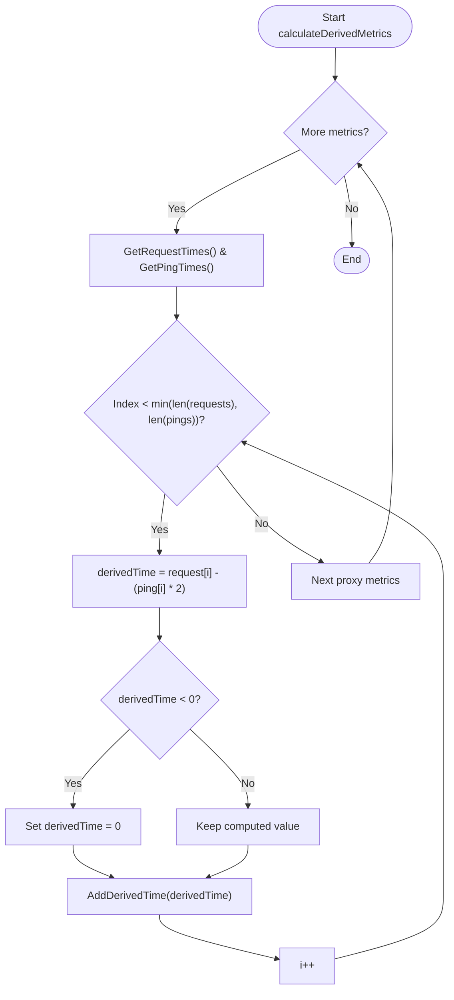
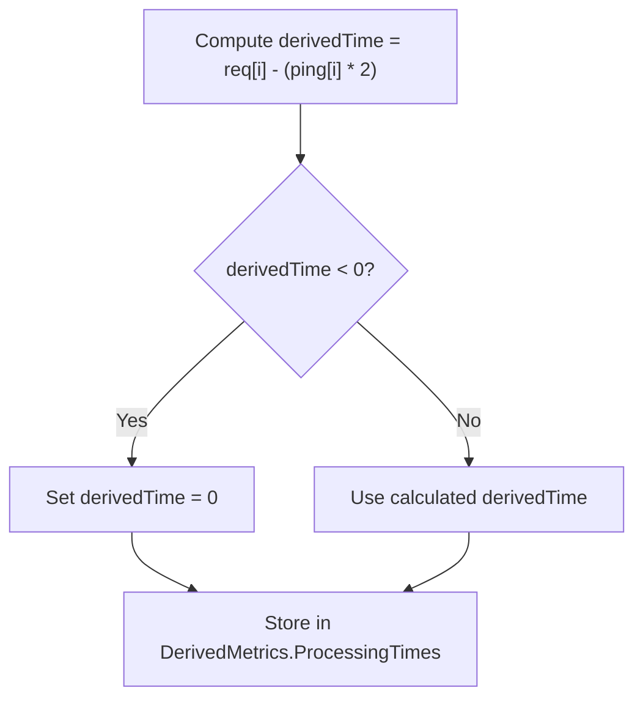
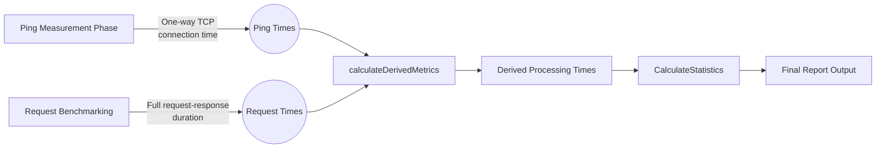

# Derived Metrics Calculation

<cite>
**Referenced Files in This Document**
- [benchmark.go](file://benchmark.go)
- [metrics.go](file://metrics.go)
- [statistics.go](file://statistics.go)
</cite>

## Table of Contents
1. [Introduction](#introduction)
2. [Core Components](#core-components)
3. [Derived Metric Computation Logic](#derived-metric-computation-logic)
4. [Significance of Proxy Processing Time](#significance-of-proxy-processing-time)
5. [Edge Case Handling](#edge-case-handling)
6. [Statistical Smoothing and Post-Processing](#statistical-smoothing-and-post-processing)
7. [Data Flow Overview](#data-flow-overview)

## Introduction
This document details the derived metrics calculation phase in the proxy benchmarking system, with a focus on computing proxy processing time as a derived metric. The core computation involves isolating internal proxy server overhead by subtracting network latency components from total request response times. This enables granular performance analysis beyond raw response times, allowing for meaningful comparisons between proxies that may have similar overall latencies but differ significantly in internal processing efficiency.

The process occurs during the `calculateDerivedMetrics()` execution phase, following the collection of both direct TCP connection times (ping) and full HTTP/SOCKS request-response durations. By analyzing these two data streams in tandem, the system computes an estimate of pure proxy processing overhead, which is then used for statistical reporting and comparative analysis.

## Core Components

The derived metrics calculation relies on three primary components: the `BenchmarkEngine` responsible for orchestrating the computation, the `Metrics` structure that stores timing data, and the `calculateDerivedMetrics()` method that performs the actual subtraction logic. These components work together to transform raw timing measurements into actionable performance insights.

**Section sources**
- [benchmark.go](file://benchmark.go#L240-L255)
- [metrics.go](file://metrics.go#L86-L91)

## Derived Metric Computation Logic

The derived metric calculation is implemented in the `calculateDerivedMetrics()` method of the `BenchmarkEngine` struct. For each proxy being benchmarked, this method retrieves synchronized arrays of request times and ping times collected during earlier phases of the benchmark.

The key computation applies the formula:  
`processing_time = request_time - (ping_time * 2)`

This formula accounts for round-trip network latency by doubling the one-way ping measurement (TCP handshake time), then subtracting this estimated network component from the total request duration. The result represents an approximation of the time spent within the proxy server itself handling the request, excluding network transmission delays.

The iteration ensures alignment between corresponding measurements by processing entries at matching indices in both arrays, up to the length of the shorter array to prevent index out-of-bounds errors.

**Diagram sources**
- [benchmark.go](file://benchmark.go#L240-L255)
- [metrics.go](file://metrics.go#L86-L91)

**Section sources**
- [benchmark.go](file://benchmark.go#L240-L255)

## Significance of Proxy Processing Time

The derived proxy processing time metric provides critical insight into the internal efficiency of proxy servers by isolating computational overhead from network effects. Two proxies might exhibit identical average response times while having dramatically different performance characteristics:

- A proxy with low ping time but high processing time indicates excellent network connectivity but inefficient internal handling (e.g., slow authentication, poor connection pooling, or resource contention).
- A proxy with high ping time but low processing time suggests network path issues but efficient server-side operations.

By separating these factors, the derived metric enables more informed decision-making when selecting proxies based on specific requirements. For example, applications sensitive to processing overhead (such as high-frequency trading systems) can prioritize proxies with minimal internal latency, even if they have slightly higher network round-trip times.

Additionally, this metric facilitates fairer comparisons across geographically distributed proxies, where network distance would otherwise dominate performance measurements and obscure differences in server quality.

**Section sources**
- [benchmark.go](file://benchmark.go#L240-L255)
- [metrics.go](file://metrics.go#L86-L91)

## Edge Case Handling

The implementation includes safeguards for several potential edge cases that could compromise metric accuracy:

1. **Negative Values**: Due to clock precision limitations or timing jitter, it's possible for `(request_time - ping*2)` to yield negative results despite the theoretical expectation that request time should always exceed network round-trip time. To handle this, any negative computed value is clamped to zero using conditional logic before storage.

2. **Measurement Mismatch**: The algorithm iterates only up to the minimum length of the request and ping time arrays, preventing index-out-of-bounds errors when measurement counts differ due to failures in either phase.

3. **Failed Measurements**: Failed ping attempts are recorded as zero values, which when doubled still contribute minimally to the subtraction term, effectively treating failed pings as best-effort measurements rather than invalidating entire datasets.

These robustness measures ensure that the derived metrics remain meaningful even under imperfect network conditions or partial measurement failures.

**Diagram sources**
- [benchmark.go](file://benchmark.go#L240-L255)

**Section sources**
- [benchmark.go](file://benchmark.go#L240-L255)

## Statistical Smoothing and Post-Processing

Following the initial derivation of processing times, the system applies statistical smoothing through the `UpdateMetricsStatistics()` function in `statistics.go`. This post-processing phase calculates aggregate statistics including mean, median, standard deviation, and configurable percentiles across the derived processing time series.

The statistical analysis transforms individual measurements into stable, comparable metrics suitable for ranking and reporting. By focusing on central tendency measures like the mean and median, the system mitigates the impact of outliers and transient spikes. Percentile analysis (e.g., 95th or 99th percentile) helps identify proxies with consistent performance versus those exhibiting occasional severe degradation.

These smoothed statistics form the basis for the final comparison reports, particularly the short summary output which uses the mean derived processing time as its primary ranking criterion.

**Section sources**
- [statistics.go](file://statistics.go#L55-L61)
- [reporter.go](file://reporter.go#L74-L85)

## Data Flow Overview

The derived metrics calculation fits into a sequential pipeline of data collection and transformation:

1. Ping measurements capture pure network latency via TCP handshake timing
2. Request measurements capture end-to-end latency including network + proxy processing
3. Derived metrics computation subtracts estimated network components
4. Statistical processing aggregates individual measurements into summary metrics
5. Reporting outputs both detailed and condensed views of proxy performance

This layered approach transforms raw timing data into actionable intelligence about proxy server efficiency, enabling users to make informed decisions based on both network performance and computational overhead.

**Diagram sources**
- [benchmark.go](file://benchmark.go#L240-L255)
- [statistics.go](file://statistics.go#L55-L61)

**Section sources**
- [benchmark.go](file://benchmark.go#L240-L255)
- [statistics.go](file://statistics.go#L55-L61)