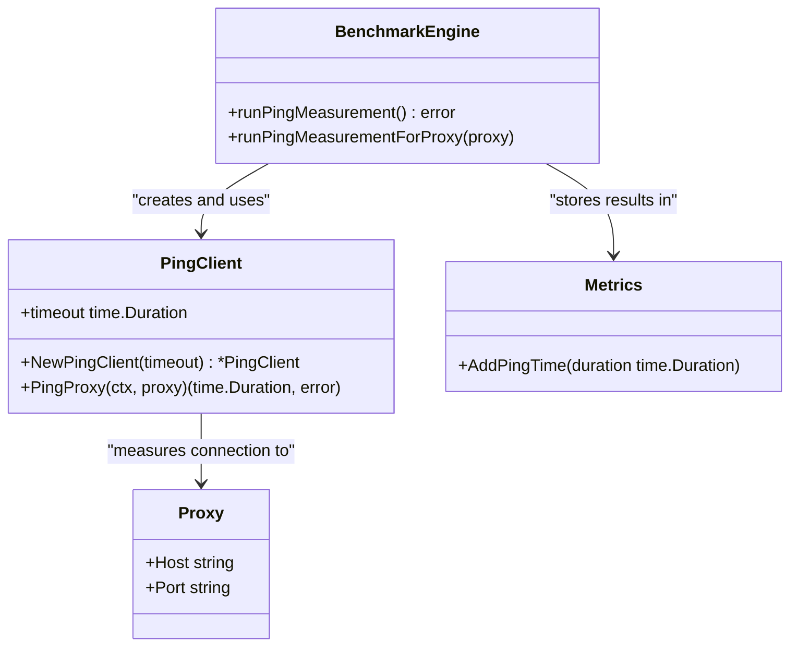
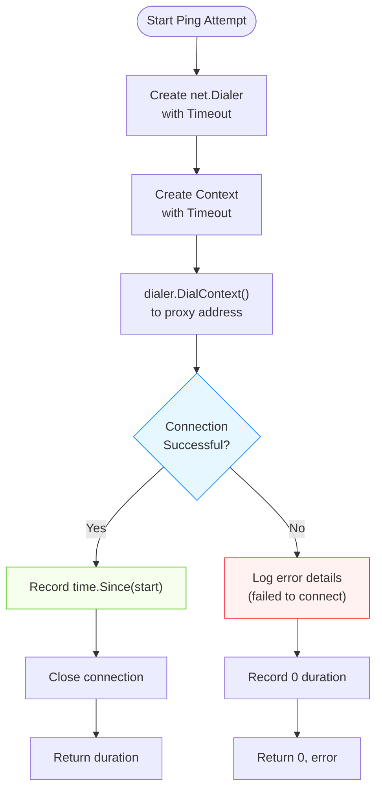
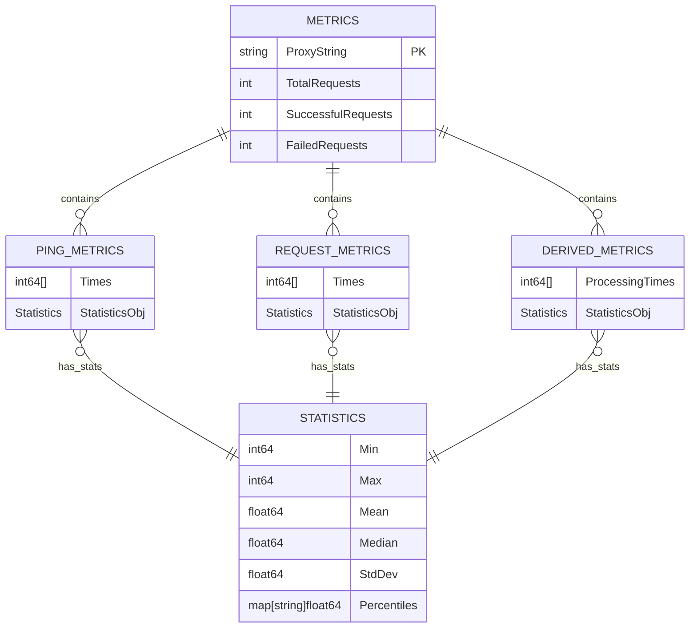
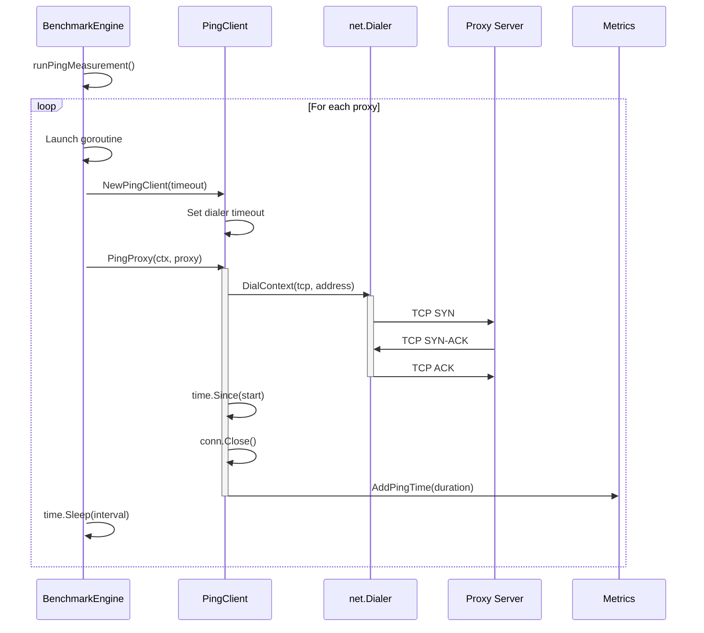

# Ping Measurement

<cite>
**Referenced Files in This Document**   
- [ping.go](file://ping.go)
- [benchmark.go](file://benchmark.go)
- [metrics.go](file://metrics.go)
- [config.go](file://config.go)
</cite>

## Table of Contents
1. [Introduction](#introduction)
2. [Ping Measurement Architecture](#ping-measurement-architecture)
3. [TCP Connection Latency Measurement](#tcp-connection-latency-measurement)
4. [Timeout and Error Handling](#timeout-and-error-handling)
5. [Metrics Collection and Storage](#metrics-collection-and-storage)
6. [Network-Level Failure Scenarios](#network-level-failure-scenarios)
7. [Integration with Benchmark Orchestration](#integration-with-benchmark-orchestration)

## Introduction
The ping measurement phase is a critical component of the proxy benchmarking process, designed to evaluate the raw network latency between the client and proxy servers. Unlike higher-level HTTP or SOCKS requests, this phase focuses exclusively on measuring the time required to establish a direct TCP connection to each proxy endpoint. This measurement provides a baseline for network performance that is independent of application-layer protocols, enabling more accurate analysis of proxy server responsiveness and network conditions.

The implementation leverages Go's standard `net` package to perform low-level TCP dialing operations, capturing precise timing data while implementing robust timeout and error handling mechanisms. Results are systematically stored in a structured metrics system for subsequent statistical analysis and reporting.

**Section sources**
- [ping.go](file://ping.go#L1-L40)
- [benchmark.go](file://benchmark.go#L147-L171)

## Ping Measurement Architecture
The ping measurement functionality is implemented through a modular architecture consisting of three primary components: the `PingClient` responsible for executing individual connection attempts, the `BenchmarkEngine` orchestrating the overall measurement process, and the `Metrics` system storing collected data.

**Diagram sources**
- [ping.go](file://ping.go#L8-L40)
- [benchmark.go](file://benchmark.go#L147-L171)
- [metrics.go](file://metrics.go#L78-L83)

## TCP Connection Latency Measurement
The core functionality for measuring TCP connection latency resides in the `PingClient.PingProxy` method, which establishes a raw TCP connection to a proxy server and records the duration of the handshake process. The measurement begins immediately before the connection attempt using `time.Now()` and ends when the connection is successfully established, calculating the elapsed time with `time.Since(start)`.

The implementation uses `net.Dialer.DialContext` with the "tcp" network type to initiate connections, allowing for context-based cancellation and timeout control. The measured duration represents the complete TCP three-way handshake time, including SYN, SYN-ACK, and ACK packet exchanges. After the connection is established and timing is recorded, the connection is immediately closed to prevent resource exhaustion.

This approach provides a pure measure of network round-trip time to the proxy server, excluding any application-layer protocol overhead such as HTTP headers or SOCKS authentication. The resulting ping times serve as a fundamental metric for assessing network quality and form the basis for derived processing time calculations in later phases.

**Section sources**
- [ping.go](file://ping.go#L22-L40)
- [benchmark.go](file://benchmark.go#L159-L165)

## Timeout and Error Handling
To ensure reliable measurements and prevent hanging operations, the ping measurement system implements comprehensive timeout and error handling mechanisms. Each connection attempt is governed by two complementary timeout strategies: a context-based timeout and a dialer-level timeout.

The `context.WithTimeout` function creates a cancellation context that automatically terminates the operation if it exceeds the specified duration, while the `net.Dialer.Timeout` field provides an additional layer of protection at the dialing level. These timeouts are configured based on the `TimeoutMs` parameter from the benchmark configuration, ensuring consistent behavior across different test scenarios.

When a connection attempt fails due to timeout or other network errors (such as connection refused, host unreachable, or DNS resolution failures), the system captures the error and logs diagnostic information. Rather than aborting the entire measurement process, failed attempts are gracefully handled by recording a zero duration in the metrics system, preserving the sequence of measurements while indicating failure status.

**Diagram sources**
- [ping.go](file://ping.go#L22-L40)
- [benchmark.go](file://benchmark.go#L159-L168)

## Metrics Collection and Storage
Ping measurement results are systematically collected and stored in the `Metrics` structure, which maintains separate collections for different types of performance data. The `PingMetrics` field specifically tracks all ping time measurements as an array of millisecond values, enabling comprehensive statistical analysis in later stages.

Each successful connection measurement is converted from `time.Duration` to milliseconds using the `Milliseconds()` method and appended to the `PingMetrics.Times` slice via the `AddPingTime` method. This method employs a mutex lock to ensure thread-safe access, which is essential given that multiple goroutines may simultaneously execute ping measurements for different proxies.

For failed connection attempts, the system records a zero value rather than omitting the measurement entirely. This approach preserves the temporal sequence of measurements and allows downstream analysis to distinguish between actual low-latency connections and measurement gaps. The complete set of ping times is later used to calculate statistical metrics such as minimum, maximum, mean, median, and percentiles, providing a comprehensive view of network performance characteristics.

**Diagram sources**
- [metrics.go](file://metrics.go#L1-L45)
- [metrics.go](file://metrics.go#L78-L83)

## Network-Level Failure Scenarios
The ping measurement system must contend with various network-level issues that can impact measurement accuracy and reliability. Common failure scenarios include connection resets, firewall blocks, DNS resolution failures, and network congestion.

Connection resets typically occur when the target proxy server actively refuses incoming connections, often due to rate limiting, authentication requirements, or service unavailability. Firewall blocks may manifest as silent drops of packets, leading to timeout conditions rather than immediate connection refusal. DNS resolution failures prevent the translation of hostnames to IP addresses, making connection attempts impossible even before the TCP handshake begins.

These network issues directly impact ping metrics by generating failed measurement attempts, which are recorded as zero values in the metrics system. While these failures reduce the overall success rate, they provide valuable diagnostic information about proxy availability and network health. Downstream calculations, particularly the derivation of processing times, account for these failures by aligning request and ping measurements chronologically and handling missing data appropriately.

The system's timeout mechanisms ensure that transient network issues do not cause indefinite blocking, while the logging of specific error messages aids in diagnosing the root causes of connectivity problems. This comprehensive error handling enables users to distinguish between poor network performance (high but valid ping times) and outright connectivity failures.

**Section sources**
- [ping.go](file://ping.go#L30-L33)
- [benchmark.go](file://benchmark.go#L166-L168)

## Integration with Benchmark Orchestration
The ping measurement phase is seamlessly integrated into the overall benchmark orchestration process through the `BenchmarkEngine` component. The engine coordinates the execution of ping measurements across all configured proxies, managing concurrency, timing intervals, and result aggregation.

The `runPingMeasurement` method initiates concurrent measurement routines for each proxy, ensuring efficient utilization of system resources while maintaining isolation between different proxy tests. Before each measurement, the engine applies an interval delay (except for the first attempt) to prevent overwhelming the network or target servers with rapid-fire connection attempts.

Configuration parameters from the `Config` structure, including timeout duration and number of requests, are propagated to the `PingClient` instance, ensuring consistency with the overall benchmark settings. After completing all ping measurements, the engine proceeds to subsequent phases, using the collected ping data as input for derived metric calculations that isolate proxy processing time from network latency.

This orchestrated approach ensures that ping measurements are performed systematically and reproducibly, providing a solid foundation for comparative analysis of proxy performance characteristics.

**Diagram sources**
- [benchmark.go](file://benchmark.go#L147-L171)
- [ping.go](file://ping.go#L22-L40)
- [metrics.go](file://metrics.go#L78-L83)