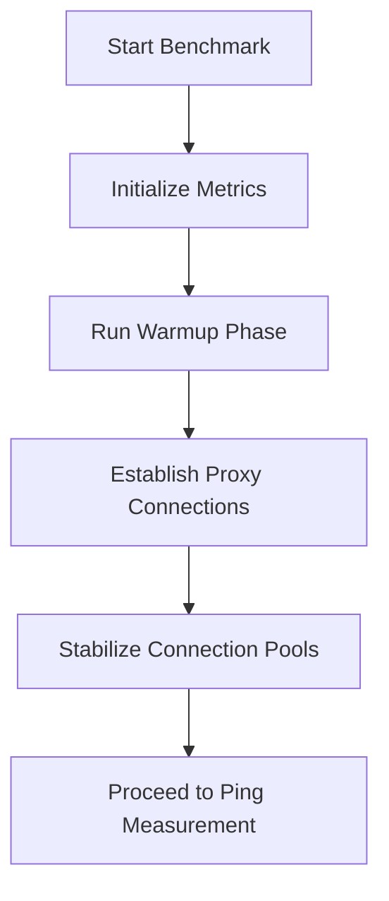
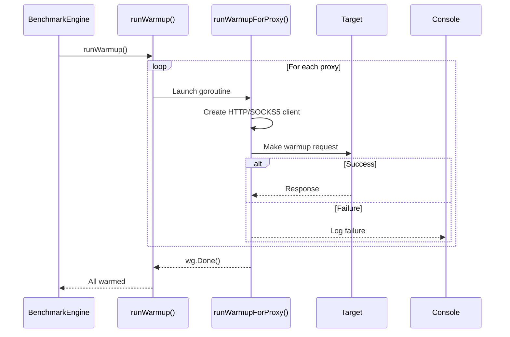

# Warmup Phase

<cite>
**Referenced Files in This Document **   
- [benchmark.go](file://benchmark.go)
- [config.go](file://config.go)
- [http_client.go](file://http_client.go)
- [socks5_client.go](file://socks5_client.go)
- [proxy.go](file://proxy.go)
</cite>

## Table of Contents
1. [Introduction](#introduction)
2. [Purpose of the Warmup Phase](#purpose-of-the-warmup-phase)
3. [Implementation in BenchmarkEngine.Run](#implementation-in-benchmarkengine-run)
4. [Warmup Execution Flow](#warmup-execution-flow)
5. [Error Handling During Warmup](#error-handling-during-warmup)
6. [Impact on Subsequent Benchmarking Phases](#impact-on-subsequent-benchmarking-phases)
7. [Configuration Parameters](#configuration-parameters)
8. [Common Issues and Troubleshooting](#common-issues-and-troubleshooting)

## Introduction
The warmup phase is a critical preliminary step in the proxy benchmarking process, executed before any formal performance measurements begin. It ensures that proxy connections are properly initialized and stabilized to eliminate cold-start effects that could skew latency and throughput metrics. This document details how the warmup phase is implemented within the `BenchmarkEngine.Run` method in `benchmark.go`, its role in priming connection pools, and its impact on measurement accuracy.

**Section sources**
- [benchmark.go](file://benchmark.go#L39-L75)

## Purpose of the Warmup Phase
The primary purpose of the warmup phase is to mitigate cold-start effects in proxy servers by establishing initial connections and allowing systems to reach a steady state before actual benchmarking begins. This includes:
- **Priming connection pools**: Ensuring that underlying TCP connections or authentication handshakes are completed.
- **Stabilizing network paths**: Allowing routing tables, firewalls, and intermediate infrastructure to cache session information.
- **Reducing measurement noise**: Eliminating outliers caused by first-time setup overhead such as DNS resolution, TLS negotiation, or SOCKS5 handshake delays.

By warming up proxies, subsequent phases like ping measurement and request benchmarking yield more consistent and representative data.



**Diagram sources **
- [benchmark.go](file://benchmark.go#L39-L75)
- [benchmark.go](file://benchmark.go#L78-L91)

## Implementation in BenchmarkEngine.Run
The warmup phase is invoked directly within the `BenchmarkEngine.Run` method, which orchestrates the entire benchmark lifecycle. After initializing metrics for each proxy, the engine calls `b.runWarmup()` as the first operational phase:

```go
// Run executes the complete benchmark process
func (b *BenchmarkEngine) Run() error {
	fmt.Println("Starting proxy benchmark...")

	// Initialize metrics for each proxy
	for _, proxy := range b.proxies {
		b.metrics[proxy.String()] = NewMetrics(proxy.String())
	}

	// Run warmup phase
	fmt.Println("Running warmup phase...")
	if err := b.runWarmup(); err != nil {
		return fmt.Errorf("warmup phase failed: %w", err)
	}
	...
}
```

If the warmup fails, the entire benchmark is aborted with an appropriate error message, ensuring unreliable results are not generated from improperly warmed proxies.

**Section sources**
- [benchmark.go](file://benchmark.go#L39-L75)

## Warmup Execution Flow
The warmup process is implemented across two methods: `runWarmup` and `runWarmupForProxy`. The former manages concurrency using a `sync.WaitGroup`, launching goroutines for each proxy:

```go
func (b *BenchmarkEngine) runWarmup() error {
	var wg sync.WaitGroup

	for _, proxy := range b.proxies {
		wg.Add(1)
		go func(p *Proxy) {
			defer wg.Done()
			b.runWarmupForProxy(p)
		}(proxy)
	}

	wg.Wait()
	return nil
}
```

Each individual proxy undergoes a series of warmup requests defined by the configuration (`WarmupRequests`). For each request:
1. A context with timeout is created.
2. An appropriate client (`HTTPClient` or `SOCKS5Client`) is instantiated based on the proxy protocol.
3. A GET request is made to the target URL specified in the config.

This parallelized approach ensures all proxies are warmed efficiently without blocking.



**Diagram sources **
- [benchmark.go](file://benchmark.go#L78-L91)
- [benchmark.go](file://benchmark.go#L94-L128)

## Error Handling During Warmup
Errors during the warmup phase are logged but do not halt execution for other proxies. Common issues include:
- **Authentication failures**: Incorrect username/password in proxy credentials.
- **Connection timeouts**: Network unreachable or firewall blocking.
- **Unsupported protocols**: Invalid or unrecognized proxy types.

When creating a client fails (e.g., `NewHTTPClient` or `NewSOCKS5Client` returns an error), the function logs the issue and exits early for that proxy. Similarly, if a warmup request fails due to network issues, it is logged but does not stop further warmup attempts.

However, while individual proxy errors are tolerated, structural failures (like invalid configuration parsing) would prevent the warmup from starting at all. Since `runWarmup()` itself always returns `nil`, no error propagates back unless explicitly checked in future enhancements.

**Section sources**
- [benchmark.go](file://benchmark.go#L94-L128)
- [http_client.go](file://http_client.go#L17-L36)
- [socks5_client.go](file://socks5_client.go#L16-L40)

## Impact on Subsequent Benchmarking Phases
A successful warmup phase significantly improves the reliability of subsequent measurements:
- **Ping measurements** reflect true network latency rather than including handshake overhead.
- **Request benchmarking** captures steady-state response times, avoiding inflated values from initial setup costs.
- **Derived metrics**, such as processing time (request time minus double ping time), become more accurate when based on stabilized baselines.

Without warmup, benchmarks may report artificially high latencies and lower throughput, leading to incorrect conclusions about proxy performance.

**Section sources**
- [benchmark.go](file://benchmark.go#L131-L144)
- [benchmark.go](file://benchmark.go#L174-L187)

## Configuration Parameters
The behavior of the warmup phase is controlled via the `BenchmarkConfig` struct in `config.go`. Key parameters include:

| Parameter | Description | Default Value |
|---------|-------------|---------------|
| `WarmupRequests` | Number of warmup requests per proxy | 10 |
| `TimeoutMs` | Maximum time to wait for a warmup request | 30,000 ms |
| `TargetURL` | Endpoint used for warmup requests | https://httpbin.org/get |
| `IntervalMs` | Delay between requests (not used in warmup) | 5,000 ms |

These can be customized in the JSON configuration file. For example:
```json
"benchmark": {
  "warmup_requests": 20,
  "timeout_ms": 15000,
  "target_url": "https://example.com"
}
```

**Section sources**
- [config.go](file://config.go#L10-L20)

## Common Issues and Troubleshooting
Several issues may arise during the warmup phase:

### 1. Authentication Errors
If proxy credentials are incorrect, `NewHTTPClient` or `NewSOCKS5Client` will fail during URL construction or dialing:
```
Failed to create HTTP client for proxy x.x.x.x: invalid userinfo
```
Ensure usernames and passwords in the proxy string are correctly formatted and URL-safe.

### 2. Timeout Failures
Proxies behind restrictive firewalls or with poor connectivity may time out:
```
Warmup request failed for proxy x.x.x.x: context deadline exceeded
```
Increase `timeout_ms` in the config or verify network reachability.

### 3. Unsupported Protocols
Only `"http"`, `"https"`, and `"socks"` are supported:
```
Unsupported protocol for proxy x.x.x.x: socks5
```
Use `"socks"` instead of `"socks5"` in the proxy definition.

### 4. Invalid Proxy Format
Malformed proxy strings cause parsing errors in `ParseProxy`:
```
invalid proxy format: http:host:port:user:pass
```
Ensure exactly six components: protocol:host:port:username:password:status.

All these issues are logged to stdout, helping users diagnose misconfigurations before full benchmark execution.

**Section sources**
- [proxy.go](file://proxy.go#L10-L48)
- [http_client.go](file://http_client.go#L17-L36)
- [socks5_client.go](file://socks5_client.go#L16-L40)