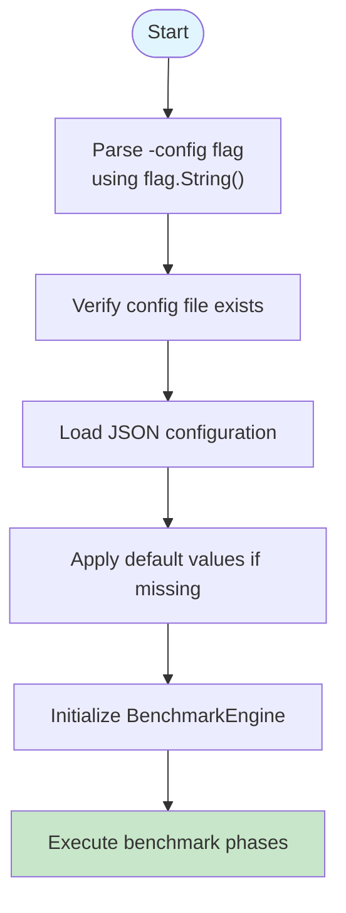

# Command Reference

<cite>
**Referenced Files in This Document **  
- [main.go](file://main.go)
- [config.go](file://config.go)
</cite>

## Table of Contents
1. [Command-Line Interface Overview](#command-line-interface-overview)
2. [Execution Methods](#execution-methods)
3. [Flag Parsing Mechanism](#flag-parsing-mechanism)
4. [Available Command-Line Options](#available-command-line-options)
5. [Syntax, Data Types, and Defaults](#syntax-data-types-and-defaults)
6. [Practical Usage Examples](#practical-usage-examples)
7. [CLI Flags and Config Struct Relationship](#cli-flags-and-config-struct-relationship)
8. [Combining CLI Flags with Configuration Files](#combining-cli-flags-with-configuration-files)
9. [Error Handling for Invalid Inputs](#error-handling-for-invalid-inputs)
10. [Debugging with Command-Line Overrides](#debugging-with-command-line-overrides)

## Command-Line Interface Overview

The proxy-benchmark tool provides a command-line interface (CLI) that allows users to control benchmark execution through flags. The CLI enables dynamic configuration overrides without modifying the JSON configuration file, supporting flexible testing scenarios and rapid iteration during performance evaluation.

**Section sources**
- [main.go](file://main.go#L9-L80)
- [config.go](file://config.go#L15-L22)

## Execution Methods

The application can be executed in two primary ways: using `go run` for development or direct binary execution for production use.

To run via Go:
```bash
go run main.go -config custom.json
```

To run via compiled binary:
```bash
./proxy-benchmark -config test-config.json
```

Both methods invoke the same flag parsing logic and configuration loading sequence defined in the `main` function.

**Section sources**
- [main.go](file://main.go#L9-L80)

## Flag Parsing Mechanism

The CLI uses Go's built-in `flag` package to parse command-line arguments. The only explicitly defined flag is `-config`, which specifies the path to the JSON configuration file. This flag is processed before any other operations occur in the program lifecycle.

Once parsed, the configuration file is loaded and its values are used to initialize the `Config` struct. Subsequent benchmark parameters are derived from this struct, allowing CLI-specified configuration files to override default behavior.



**Diagram sources **
- [main.go](file://main.go#L9-L20)

**Section sources**
- [main.go](file://main.go#L9-L20)

## Available Command-Line Options

Currently, the only supported command-line flag is:

- `-config`: Specifies the path to the JSON configuration file used for benchmark settings

This single flag controls the entire configuration source, enabling all other parameters (such as target URL, timeout, concurrency) to be overridden indirectly by pointing to different configuration files.

While no direct flags exist for individual benchmark parameters, their values can be effectively controlled through external configuration files specified via the `-config` flag.

**Section sources**
- [main.go](file://main.go#L11)

## Syntax, Data Types, and Defaults

The `-config` flag accepts a string value representing the filesystem path to a JSON configuration file.

**Syntax:**
```
-config <filepath>
```

**Data Type:** String  
**Default Value:** `"config.json"`  
**Validation:** File must exist and be readable

If the specified file does not exist, the program terminates with an error message indicating the missing configuration file.

All other benchmark parameters (requests, timeout, target URL, etc.) are governed by the `BenchmarkConfig` struct and inherit defaults when not specified in the configuration file:

| Parameter | Type | Default |
|---------|------|--------|
| Requests | int | 100 |
| IntervalMs | int | 5000 |
| WarmupRequests | int | 10 |
| TargetURL | string | https://httpbin.org/get |
| Concurrency | int | 10 |
| TimeoutMs | int | 30000 |

These defaults are applied after configuration loading if corresponding fields are zero-valued.

**Section sources**
- [main.go](file://main.go#L25-L40)
- [config.go](file://config.go#L15-L22)

## Practical Usage Examples

### Basic Execution
```bash
go run main.go
```
Uses default `config.json` file with built-in defaults for any missing values.

### Custom Configuration File
```bash
go run main.go -config test-config.json
```
Loads configuration from `test-config.json`, allowing complete parameter customization without code changes.

### Overriding Target URL Dynamically
Create a temporary config file:
```json
{
  "proxies": ["socks:localhost:1080:user:pass:enabled"],
  "benchmark": {
    "requests": 50,
    "target_url": "https://api.example.com/health"
  }
}
```
Then execute:
```bash
go run main.go -config quick-test.json
```

### Increasing Request Count for Stress Testing
```bash
# Create stress-config.json with high request count
go run main.go -config stress-config.json
```

These patterns enable rapid experimentation by decoupling configuration from execution.

**Section sources**
- [main.go](file://main.go#L9-L80)
- [config.example.json](file://config.example.json)

## CLI Flags and Config Struct Relationship

The command-line flag directly influences the initialization of the `Config` struct by determining which JSON file is used for deserialization. The flow follows this sequence:

1. Parse `-config` flag to get filepath
2. Load JSON from specified file
3. Unmarshal into `Config` struct
4. Apply default values for zero-valued fields

The `LoadConfig` function handles JSON deserialization into the `Config` struct, which contains nested structs including `BenchmarkConfig`. This hierarchical structure allows all benchmark parameters to be controlled through the configuration file referenced by the CLI flag.

There is no direct mapping between individual CLI flags and struct fields beyond the `-config` flag itself; instead, it serves as an indirection mechanism for full configuration control.

```mermaid
classDiagram
class Config {
+[]string Proxies
+BenchmarkConfig Benchmark
+StatisticsConfig Statistics
}
class BenchmarkConfig {
+int Requests
+int IntervalMs
+int WarmupRequests
+string TargetURL
+int Concurrency
+int TimeoutMs
}
class Main {
+string configPath (from -config flag)
+*Config config
}
Main --> Config : "loads from file"
Config --> BenchmarkConfig : "contains"
Main -.-> "flag" : "-config"
```

**Diagram sources **
- [main.go](file://main.go#L9-L80)
- [config.go](file://config.go#L8-L22)

**Section sources**
- [main.go](file://main.go#L9-L80)
- [config.go](file://config.go#L8-L22)

## Combining CLI Flags with Configuration Files

The design pattern separates configuration specification (via CLI) from configuration content (in JSON files). This separation enables powerful combinations:

### Environment-Specific Testing
```bash
# Development environment
go run main.go -config dev-config.json

# Production simulation
go run main.go -config prod-config.json
```

### Parameter Sweeps
Create multiple configuration files with varying parameters:
- low-concurrency.json (concurrency: 5)
- medium-concurrency.json (concurrency: 25)
- high-concurrency.json (concurrency: 50)

Then iterate through them:
```bash
for cfg in *-config.json; do
    go run main.go -config "$cfg"
done
```

### Temporary Overrides
For quick tests, create ephemeral configuration files:
```bash
echo '{"proxies":["socks:localhost:1080:::enabled"],"benchmark":{"requests":10,"target_url":"http://localhost:8080/test"}}' > temp.json
go run main.go -config temp.json
rm temp.json
```

This approach maintains clean separation between permanent configurations and transient test cases.

**Section sources**
- [main.go](file://main.go#L9-L80)
- [config.example.json](file://config.example.json)

## Error Handling for Invalid Inputs

The application implements defensive error handling around CLI input processing:

1. **Missing Configuration File**: If the file specified by `-config` does not exist, the program exits with a fatal error message showing the attempted path.

2. **Invalid JSON Format**: Malformed JSON in the configuration file results in a descriptive unmarshaling error.

3. **Unreadable Files**: Permission issues or corrupted files trigger appropriate OS-level errors.

4. **Zero-Value Protection**: Default values prevent uninitialized parameters from causing runtime failures.

Error messages include contextual information to aid troubleshooting, such as the exact file path that failed to load or the nature of the JSON parsing error.

The error handling strategy prioritizes clarity and immediate feedback, ensuring users can quickly identify and resolve configuration issues.

**Section sources**
- [main.go](file://main.go#L15-L25)

## Debugging with Command-Line Overrides

Command-line configuration switching is particularly valuable for debugging scenarios:

### Isolating Proxy Issues
Create minimal configuration files to test specific proxies:
```bash
go run main.go -config single-proxy.json
```

### Reproducing Timeouts
Configure aggressive timeouts to surface timing-related bugs:
```bash
go run main.go -config timeout-test.json  # timeout_ms: 1000
```

### Verifying Default Behavior
Test fallback logic by removing fields from configuration:
```bash
go run main.go -config no-timeout.json  # omit timeout_ms to trigger default
```

### Performance Regression Testing
Compare behavior across versions using identical configuration files:
```bash
# Before changes
go run main.go -config benchmark.json > results-v1.json

# After changes  
go run main.go -config benchmark.json > results-v2.json
```

The ability to rapidly switch configurations via the `-config` flag makes it easy to isolate variables during investigation and validate fixes under consistent conditions.

**Section sources**
- [main.go](file://main.go#L9-L80)
- [test-config.json](file://test-config.json)