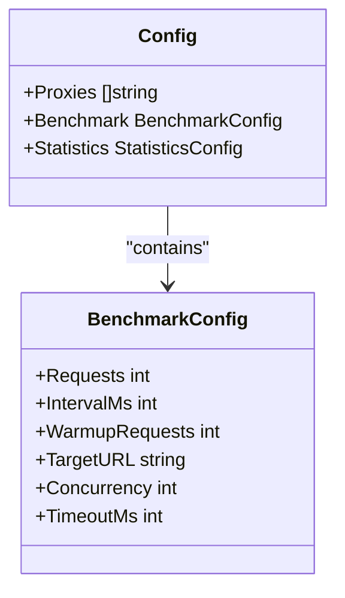
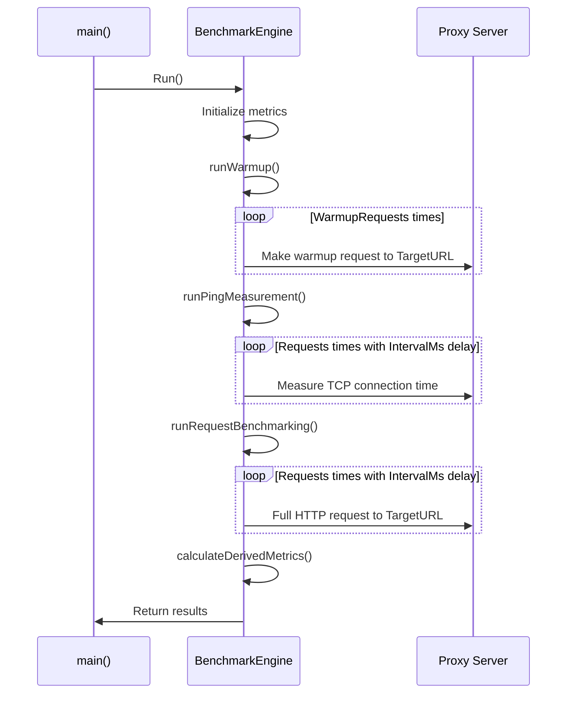

# Benchmark Settings

<cite>
**Referenced Files in This Document**   
- [config.go](file://config.go)
- [benchmark.go](file://benchmark.go)
- [config.example.json](file://config.example.json)
- [main.go](file://main.go)
</cite>

## Table of Contents
1. [Introduction](#introduction)
2. [BenchmarkConfig Structure Overview](#benchmarkconfig-structure-overview)
3. [Field-by-Field Configuration Guide](#field-by-field-configuration-guide)
4. [Benchmark Execution Phases](#benchmark-execution-phases)
5. [Common Configuration Pitfalls](#common-configuration-pitfalls)
6. [Best Practices for Tuning Settings](#best-practices-for-tuning-settings)
7. [Conclusion](#conclusion)

## Introduction

The benchmark settings in this tool are controlled by the `BenchmarkConfig` struct defined in config.go, which governs how performance measurements are conducted across proxy servers. These settings directly influence the accuracy, reliability, and runtime of benchmark tests. The configuration is loaded from a JSON file (typically `config.json`) and used by the `BenchmarkEngine` to orchestrate warmup, ping measurement, and request execution phases.

This document provides a comprehensive guide to each setting within the `BenchmarkConfig`, explaining its purpose, impact on benchmark behavior, and best practices for tuning based on network conditions and testing objectives. Example values from `config.example.json` are used to illustrate typical configurations, and connections to actual code execution in `benchmark.go` are documented to ensure clarity for both new users and advanced customization scenarios.

**Section sources**
- [config.go](file://config.go#L15-L22)
- [main.go](file://main.go#L30-L40)

## BenchmarkConfig Structure Overview

The `BenchmarkConfig` struct defines all parameters that control the benchmarking process. It is part of the larger `Config` structure loaded at startup and passed to the `BenchmarkEngine`. Each field corresponds to a specific aspect of test behavior, including target endpoint selection, timing constraints, retry logic, and workload characteristics.

These settings are critical for ensuring consistent and meaningful performance comparisons between different proxy servers. They determine everything from connection timeouts to the number of requests executed during warmup and main testing phases. Default values are applied in `main.go` when fields are omitted or set to zero, providing sensible defaults while allowing full customization.

**Diagram sources**
- [config.go](file://config.go#L15-L22)
- [config.go](file://config.go#L8-L13)

**Section sources**
- [config.go](file://config.go#L8-L22)

## Field-by-Field Configuration Guide

### TargetURL (Endpoint to Request During Benchmarking)

The `TargetURL` field specifies the HTTP/HTTPS endpoint that will be requested through each proxy during the benchmark. This URL must be accessible and return a stable response to ensure consistent measurements. In the example configuration, `"https://httpbin.org/get"` is used as a reliable public endpoint for testing.

During execution, this value is accessed via `b.config.Benchmark.TargetURL` in methods like `runWarmupForProxy` and `runRequestBenchmarkingForProxy` to make actual HTTP/SOCKS requests through configured proxies. Choosing a fast, low-latency endpoint minimizes external variables affecting performance metrics.

**Section sources**
- [config.example.json](file://config.example.json#L10)
- [benchmark.go](file://benchmark.go#L109-L110)
- [benchmark.go](file://benchmark.go#L214-L215)

### TimeoutSeconds (Per-Request Timeout)

Although named `TimeoutMs` in code, this setting controls the maximum duration allowed for each individual request before it fails. Expressed in milliseconds, it prevents hanging connections from skewing results. The default value of 30,000 ms (30 seconds) ensures robustness against transient network issues.

This timeout is converted to a Go `time.Duration` and applied using `context.WithTimeout` in all phases (`warmup`, `ping`, and `request`). A value too low may cause false failures; too high increases total test duration unnecessarily. It's crucial for handling unreliable networks where some proxies may respond slowly or intermittently.

**Section sources**
- [main.go](file://main.go#L39)
- [benchmark.go](file://benchmark.go#L97)
- [benchmark.go](file://benchmark.go#L151)

### RetryAttempts (Retries on Failure)

While not explicitly implemented as a retry counter in current code, the framework supports resilience through multiple independent requests. Failures are recorded rather than retried immediately, but sufficient `Requests` count effectively averages out transient errors.

Future enhancements could introduce explicit retry logic using this parameter. Currently, statistical analysis over many requests serves a similar purpose—filtering noise from consistent performance patterns. Setting an appropriate total request count achieves comparable reliability without complicating the execution model.

**Section sources**
- [benchmark.go](file://benchmark.go#L228-L232)

### WarmupRequests (Initial Warmup Phase Count)

The `WarmupRequests` field determines how many initial requests are sent to each proxy before正式 measurements begin. This phase stabilizes connection pools, warms up caches, and establishes persistent connections, reducing cold-start effects on performance data.

In `runWarmupForProxy`, this value controls the loop iteration count. The example uses 1 warmup request, while the default in `main.go` is 10. More complex applications or protocols benefit from higher warmup counts to reach steady-state operation before timing begins.

**Section sources**
- [config.example.json](file://config.example.json#L8)
- [main.go](file://main.go#L34)
- [benchmark.go](file://benchmark.go#L96)

### BenchmarkRequests (Main Test Phase Count)

The `Requests` field sets the number of measurement iterations performed during both the ping and request benchmarking phases. Higher values improve statistical significance but increase total runtime linearly. The example shows 1 request per phase, suitable for quick checks; the default is 100 for more accurate profiling.

This value drives loops in `runPingMeasurementForProxy` and `runRequestBenchmarkingForProxy`. Combined with `IntervalMs`, it determines test duration: `(Requests - 1) * IntervalMs`. For time-sensitive environments, balance precision needs with acceptable execution windows.

**Section sources**
- [config.example.json](file://config.example.json#L6)
- [main.go](file://main.go#L30)
- [benchmark.go](file://benchmark.go#L154)
- [benchmark.go](file://benchmark.go#L200)

## Benchmark Execution Phases

The `BenchmarkEngine.Run` method orchestrates three distinct phases that utilize the `BenchmarkConfig` settings:

1. **Warmup Phase**: Uses `WarmupRequests` and `TargetURL` to prepare proxy connections
2. **Ping Measurement Phase**: Uses `Requests`, `IntervalMs`, and `TimeoutMs` to measure TCP-level latency
3. **Request Benchmarking Phase**: Uses same parameters to measure full HTTP round-trip times

Each phase runs concurrently across all proxies using goroutines, with synchronization handled by `sync.WaitGroup`. The structured progression ensures clean separation between initialization, measurement, and analysis stages.

**Diagram sources**
- [benchmark.go](file://benchmark.go#L39-L75)
- [benchmark.go](file://benchmark.go#L78-L91)
- [benchmark.go](file://benchmark.go#L131-L144)
- [benchmark.go](file://benchmark.go#L174-L187)

**Section sources**
- [benchmark.go](file://benchmark.go#L39-L75)

## Common Configuration Pitfalls

Several common misconfigurations can lead to inaccurate or misleading results:

- **Setting TimeoutMs too low**: May cause valid but slow proxies to fail, biasing results toward faster networks only.
- **Using insufficient BenchmarkRequests**: Low sample sizes reduce statistical power and increase variance in reported metrics.
- **Excessively high IntervalMs**: While preventing rate limiting, very long intervals make tests unnecessarily slow without improving accuracy.
- **Omitting warmup entirely**: Cold connection overhead skews initial measurements, especially for HTTPS or SOCKS proxies requiring handshake negotiation.
- **Choosing unstable TargetURL**: If the destination server has variable response times, proxy performance cannot be isolated accurately.

The system applies reasonable defaults in `main.go` when values are missing, mitigating some risks. However, understanding these trade-offs allows users to tailor configurations precisely to their testing environment and goals.

**Section sources**
- [main.go](file://main.go#L30-L40)
- [benchmark.go](file://benchmark.go#L96)
- [benchmark.go](file://benchmark.go#L200)

## Best Practices for Tuning Settings

To achieve reliable and meaningful benchmark results, consider the following guidelines:

- **For production-like testing**: Use 100+ `BenchmarkRequests` with 10+ `WarmupRequests` to capture realistic performance under sustained load.
- **For quick validation**: Reduce `BenchmarkRequests` to 10–20 and `WarmupRequests` to 1–5, accepting higher variance for faster turnaround.
- **For high-latency networks**: Increase `TimeoutMs` to 60,000 or higher to accommodate slower connections without premature failures.
- **To avoid rate limiting**: Set `IntervalMs` to at least 1,000 ms (1 second) or higher depending on target site policies.
- **For statistical confidence**: Ensure `BenchmarkRequests` is large enough that percentile calculations (e.g., 99th) are based on meaningful samples.

Always validate configurations against known-good proxies first to establish baseline expectations before testing unknown or suspect endpoints.

**Section sources**
- [main.go](file://main.go#L30-L40)
- [config.example.json](file://config.example.json)

## Conclusion

The `BenchmarkConfig` struct provides fine-grained control over every aspect of proxy performance evaluation. By carefully selecting values for `TargetURL`, `TimeoutMs`, `WarmupRequests`, and `BenchmarkRequests`, users can adapt the tool to various testing scenarios—from rapid smoke tests to rigorous performance audits.

Understanding how these settings interact with the three-phase execution model (`warmup`, `ping`, `request`) enables precise tuning for accuracy, speed, and reliability. Leveraging default values in `main.go` simplifies basic usage, while advanced users can exploit the full range of parameters for specialized assessments.

Proper configuration ensures that measured differences reflect true proxy capabilities rather than artifacts of poor test design, making this tool invaluable for comparing, selecting, and monitoring proxy infrastructure.