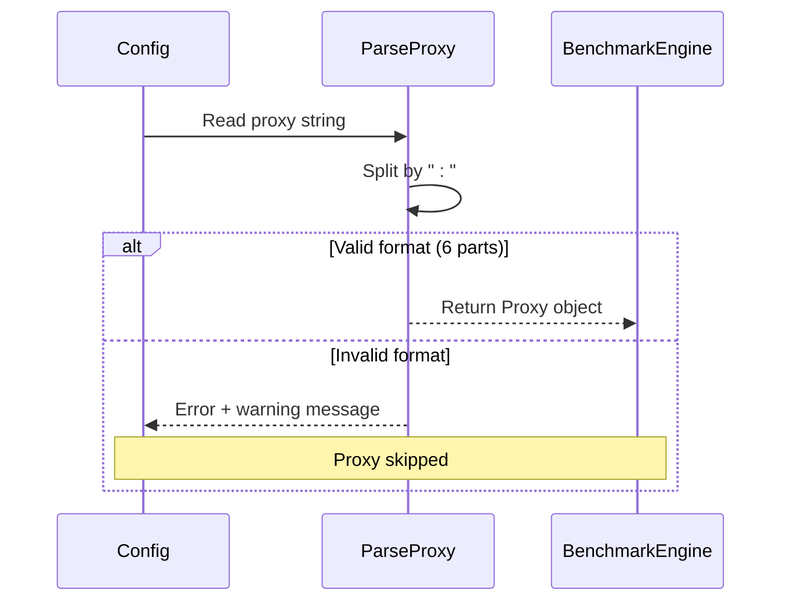
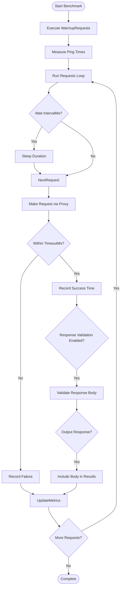
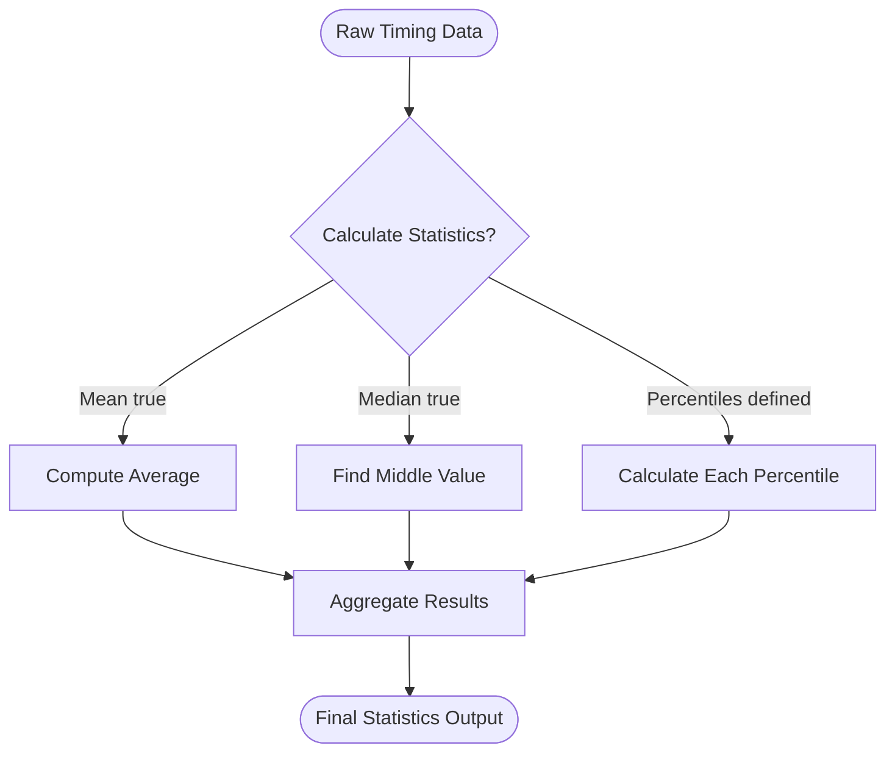
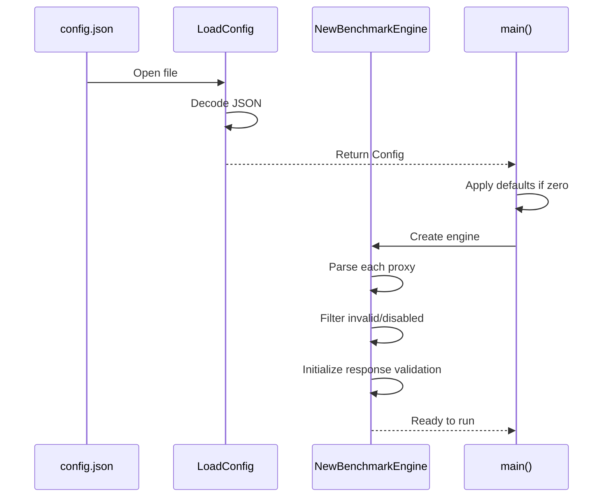
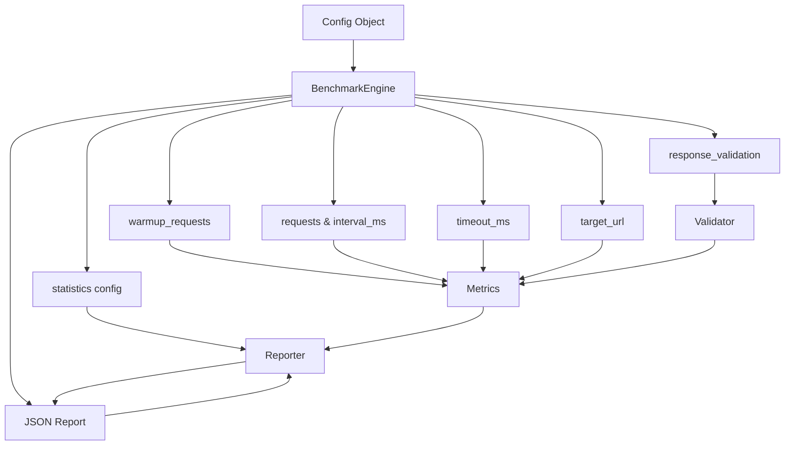

# Configuration Guide

<cite>
**Referenced Files in This Document**
- [config.go](file://config.go) - *Updated with ResponseValidation and OutputResponse fields*
- [env_config.go](file://env_config.go) - *Added environment variable support for proxies*
- [ENV_CONFIG.md](file://ENV_CONFIG.md) - *New documentation for environment configuration*
- [config.example.json](file://config.example.json)
- [validation_test.go](file://validation_test.go) - *Added response validation tests*
</cite>

## Update Summary
**Changes Made**
- Added new section on Response Validation Configuration to document the ResponseValidation struct
- Added new section on Environment Variable Support to document TEST_PROXIES and template system
- Updated Benchmark Settings section to include new OutputResponse field
- Enhanced Common Configuration Mistakes with response validation examples
- Added new usage patterns for API-specific testing configurations
- Updated source references throughout to reflect new files and changes

## Table of Contents
1. [Introduction](#introduction)
2. [Configuration Structure Overview](#configuration-structure-overview)
3. [Proxies Configuration](#proxies-configuration)
4. [Benchmark Settings](#benchmark-settings)
5. [Statistics Configuration](#statistics-configuration)
6. [Response Validation Configuration](#response-validation-configuration)
7. [Environment Variable Support](#environment-variable-support)
8. [Default Values and Validation](#default-values-and-validation)
9. [Usage Patterns](#usage-patterns)
10. [Common Configuration Mistakes](#common-configuration-mistakes)
11. [How Configuration Drives BenchmarkEngine](#how-configuration-drives-benchmarkengine)

## Introduction
The proxy-benchmark tool uses a JSON-based configuration system to define proxy lists, benchmark parameters, statistical analysis settings, and response validation rules. This guide provides a comprehensive explanation of the `config.json` structure based on the `Config` struct defined in `config.go`. It details how each configuration field influences the behavior of the `BenchmarkEngine`, including default values, validation rules, and practical usage examples.

**Section sources**
- [config.go](file://config.go#L8-L29)

## Configuration Structure Overview
The configuration is structured into four main sections: `proxies`, `benchmark`, `statistics`, and `response_validation`. These correspond directly to the `Config`, `BenchmarkConfig`, `StatisticsConfig`, and `ResponseValidation` structs in the codebase.

```mermaid
classDiagram
class Config {
+[]string Proxies
+BenchmarkConfig Benchmark
+StatisticsConfig Statistics
}
class BenchmarkConfig {
+int Requests
+int IntervalMs
+int WarmupRequests
+string TargetURL
+int Concurrency
+int TimeoutMs
+ResponseValidation ResponseValidation
+bool OutputResponse
}
class StatisticsConfig {
+[]float64 Percentiles
+bool Mean
+bool Median
}
class ResponseValidation {
+bool Enabled
+[]ValidationCheck Checks
}
class ValidationCheck {
+string Path
+string Type
+interface{} Value
}
Config --> BenchmarkConfig : "contains"
Config --> StatisticsConfig : "contains"
BenchmarkConfig --> ResponseValidation : "contains"
ResponseValidation --> ValidationCheck : "contains multiple"
```

**Diagram sources**
- [config.go](file://config.go#L8-L29)

**Section sources**
- [config.go](file://config.go#L8-L29)

## Proxies Configuration
The `proxies` array contains proxy entries formatted as colon-separated strings with six components: protocol, host, port, username, password, and status.

Each proxy entry follows this format:
```
protocol:host:port:username:password:status
```

Valid protocols include `http`, `https`, and `socks`. The status field determines whether a proxy is used in testing (`enabled`) or ignored (`disabled`). Only proxies with status `enabled` are processed by the `ParseProxy` function and included in benchmarking.

Example from `config.example.json`:
```json
"proxies": [
  "socks:proxy1.example.com:1080:username:password:enabled",
  "http:proxy2.example.com:8080:username:password:enabled"
]
```

The `ParseProxy` function validates that each entry has exactly six parts. Invalid formats trigger warnings and are skipped during engine initialization.



**Diagram sources**
- [proxy.go](file://proxy.go#L18-L32)
- [benchmark.go](file://benchmark.go#L18-L36)

**Section sources**
- [proxy.go](file://proxy.go#L18-L32)
- [config.example.json](file://config.example.json#L2-L6)

## Benchmark Settings
The `benchmark` section controls the core testing parameters for the `BenchmarkEngine`.

| Field | Type | Description |
|-------|------|-------------|
| requests | int | Number of benchmark requests per proxy |
| interval_ms | int | Delay between consecutive requests (milliseconds) |
| warmup_requests | int | Number of warmup requests before actual benchmarking |
| target_url | string | URL to test against through each proxy |
| concurrency | int | Maximum concurrent operations (currently not fully utilized) |
| timeout_ms | int | Request timeout threshold in milliseconds |
| response_validation | object | Configuration for validating API responses |
| output_response | bool | Whether to include response body in output |

These values directly control the behavior of `runRequestBenchmarkingForProxy` and `runWarmupForProxy` methods. For example, `interval_ms` determines the sleep duration between requests, while `timeout_ms` sets the context deadline for HTTP/SOCKS operations. The new `output_response` field allows capturing response bodies for debugging purposes.



**Diagram sources**
- [benchmark.go](file://benchmark.go#L100-L150)
- [main.go](file://main.go#L50-L60)

**Section sources**
- [config.go](file://config.go#L15-L22)
- [config.example.json](file://config.example.json#L8-L14)

## Statistics Configuration
The `statistics` section defines which statistical metrics are calculated from the collected timing data.

| Field | Type | Purpose |
|-------|------|--------|
| percentiles | []float64 | List of percentile values to calculate (e.g., 90, 95, 99) |
| mean | bool | Whether to calculate arithmetic mean |
| median | bool | Whether to calculate median value |

These settings are passed to the `UpdateMetricsStatistics` function, which computes statistics for request times, ping times, and derived processing times (request time minus twice ping time). The `CalculateStatistics` function uses the `montanaflynn/stats` library to perform calculations only for enabled metrics.

When `mean` is set to `true`, the average response time is included in results. When `median` is `true`, the middle value of sorted timings is calculated. Percentile values generate corresponding entries in the output (e.g., "90.0": 123.4).



**Diagram sources**
- [statistics.go](file://statistics.go#L56-L60)
- [metrics.go](file://metrics.go#L90-L120)

**Section sources**
- [config.go](file://config.go#L25-L29)
- [config.example.json](file://config.example.json#L15-L19)

## Response Validation Configuration
The `response_validation` section enables verification that proxy responses contain expected data structures and values.

### Validation Structure
```json
"response_validation": {
  "enabled": true,
  "checks": [
    {
      "path": "login",
      "type": "string",
      "value": "octocat"
    }
  ]
}
```

| Field | Type | Required | Description |
|-------|------|----------|-------------|
| enabled | bool | Yes | Whether to perform response validation |
| checks | array | Yes | List of validation rules to apply |

### Validation Check Fields
Each check in the `checks` array supports these fields:

| Field | Type | Required | Description |
|-------|------|----------|-------------|
| path | string | Yes | JSON path to validate (dot notation for nested fields) |
| type | string | Yes | Expected data type (boolean, number, string, array, object) |
| value | any | No | Expected value (optional, used for exact matching) |

### Supported Types
- `boolean`: Validates boolean values
- `number`: Validates numeric values (integers and floats)
- `string`: Validates string values
- `array`: Validates array structures
- `object`: Validates object structures

### Nested Field Validation
Use dot notation to validate nested JSON fields:
```json
{
  "user.profile.verified": true,
  "data.items.0.id": 123
}
```

Example from GitHub API test configuration:
```json
"response_validation": {
  "enabled": true,
  "checks": [
    {"path": "login", "type": "string", "value": "octocat"},
    {"path": "id", "type": "number"},
    {"path": "type", "type": "string", "value": "User"},
    {"path": "site_admin", "type": "boolean"},
    {"path": "public_repos", "type": "number"}
  ]
}
```

The validation process:
1. Parses the response body as JSON
2. For each check, navigates to the specified path
3. Validates the data type matches expectations
4. If `value` is specified, verifies exact match
5. Returns error if any check fails

**Section sources**
- [config.go](file://config.go#L27-L37)
- [validation_test.go](file://validation_test.go)
- [benchmark.go](file://benchmark.go#L319-L433)

## Environment Variable Support
The tool now supports loading proxy configurations from environment variables, enabling secure credential management without hardcoding in configuration files.

### Environment Variable
- `TEST_PROXIES`: Comma-separated list of proxy credentials
  - Format: `protocol:host:port:username:password:enabled`
  - Example: `http:proxy1.com:8080:user:pass:enabled,socks:proxy2.com:1080:user:pass:enabled`

### Configuration Templates
The system includes pre-built templates for common API testing scenarios:

#### GitHub API Template
```go
LoadGitHubTestConfig() *Config {
	return &Config{
		Proxies: GetTestProxies([]string{"http:proxy.example.com:8080:username:password:enabled"}),
		Benchmark: BenchmarkConfig{
			TargetURL: "https://api.github.com/users/octocat",
			ResponseValidation: &ResponseValidation{
				Enabled: true,
				Checks: []ValidationCheck{
					{Path: "login", Type: "string", Value: "octocat"},
					{Path: "id", Type: "number"},
					{Path: "type", Type: "string", Value: "User"},
				},
			},
		},
	}
}
```

#### JSONPlaceholder Template
```go
LoadJSONPlaceholderTestConfig() *Config {
	return &Config{
		Proxies: GetTestProxies([]string{"http:proxy.example.com:8080:username:password:enabled"}),
		Benchmark: BenchmarkConfig{
			TargetURL: "https://jsonplaceholder.typicode.com/posts/1",
			ResponseValidation: &ResponseValidation{
				Enabled: true,
				Checks: []ValidationCheck{
					{Path: "userId", Type: "number"},
					{Path: "id", Type: "number", Value: float64(1)},
					{Path: "title", Type: "string"},
					{Path: "body", Type: "string"},
				},
			},
		},
	}
}
```

### Usage Workflow
1. Set the environment variable:
```bash
export TEST_PROXIES="http:your-proxy.com:8080:user:pass:enabled"
```

2. Use the helper functions in code:
```go
// Get proxies from environment or use fallback
proxies := GetTestProxies([]string{"http:fallback.com:8080:user:pass:enabled"})

// Load pre-configured test setup
config := LoadGitHubTestConfig()
```

3. Run tests with environment variables:
```bash
./test_with_env.sh
```

The `GetTestProxies` function automatically splits the comma-separated list and trims whitespace from each proxy entry.

**Section sources**
- [env_config.go](file://env_config.go#L9-L108)
- [ENV_CONFIG.md](file://ENV_CONFIG.md)

## Default Values and Validation
The application applies default values when fields are omitted or set to zero, primarily handled in the `main` function's configuration setup phase.

| Field | Default Value | Source |
|-------|---------------|--------|
| requests | 100 | main.go |
| interval_ms | 5000 | main.go |
| warmup_requests | 10 | main.go |
| target_url | https://httpbin.org/get | main.go |
| concurrency | 10 | main.go |
| timeout_ms | 30000 | main.go |

Validation occurs at multiple levels:
1. **JSON parsing**: `LoadConfig` ensures valid JSON syntax
2. **Field validation**: Zero values trigger defaults
3. **Proxy format**: `ParseProxy` requires exactly six colon-separated parts
4. **Status validation**: Only "enabled" proxies are used
5. **Response validation**: `validateResponse` checks JSON structure and content

The `LoadConfig` function performs initial JSON decoding, while subsequent validation happens during `NewBenchmarkEngine` creation when proxies are parsed and filtered.



**Diagram sources**
- [config.go](file://config.go#L32-L47)
- [main.go](file://main.go#L40-L60)
- [benchmark.go](file://benchmark.go#L18-L36)

**Section sources**
- [main.go](file://main.go#L40-L60)
- [config.go](file://config.go#L32-L47)

## Usage Patterns
### Multiple Proxy Types
You can mix different proxy types in the same configuration:

```json
"proxies": [
  "http:proxy-http.example.com:8080:user:pass:enabled",
  "socks:proxy-socks.example.com:1080:user:pass:enabled"
]
```

The `BenchmarkEngine` automatically selects the appropriate client (`HTTPClient` or `SOCKS5Client`) based on the protocol field.

### Customizing Benchmark Intensity
Adjust intensity by modifying key parameters:
- Increase `requests` for more data points
- Decrease `interval_ms` for higher frequency testing
- Set `warmup_requests` to prime connections
- Lower `timeout_ms` to filter slow proxies

Example high-intensity configuration:
```json
"benchmark": {
  "requests": 500,
  "interval_ms": 1000,
  "warmup_requests": 20,
  "timeout_ms": 10000
}
```

### Advanced Statistics Configuration
Customize percentile analysis for detailed performance insights:

```json
"statistics": {
  "percentiles": [50, 75, 90, 95, 99],
  "mean": true,
  "median": false
}
```

This setup provides granular insight into tail latency while disabling median calculation to reduce output size.

### API-Specific Testing
Use response validation to test proxy functionality with real APIs:

```json
"benchmark": {
  "target_url": "https://api.github.com/users/octocat",
  "response_validation": {
    "enabled": true,
    "checks": [
      {"path": "login", "type": "string", "value": "octocat"},
      {"path": "id", "type": "number"},
      {"path": "type", "type": "string", "value": "User"}
    ]
  }
}
```

### Environment-Based Testing
Use environment variables for secure credential management:

```bash
export TEST_PROXIES="http:my-proxy.com:8080:user:pass:enabled"
go run . -config test-configs/github-test.json
```

**Section sources**
- [config.example.json](file://config.example.json)
- [config.json](file://config.json)
- [env_config.go](file://env_config.go)

## Common Configuration Mistakes
### Malformed JSON
Missing commas, extra trailing commas, or mismatched brackets cause parsing failures:
```json
// WRONG - Missing comma
"proxies": ["a:b:c:d:e:f:enabled" "g:h:i:j:k:l:enabled"]

// CORRECT
"proxies": ["a:b:c:d:e:f:enabled", "g:h:i:j:k:l:enabled"]
```

### Invalid URLs
Ensure `target_url` uses proper scheme and domain:
```json
// WRONG
"target_url": "httpbin.org/get"

// CORRECT
"target_url": "https://httpbin.org/get"
```

### Incorrect Proxy Format
Each proxy must have exactly six colon-separated fields:
```json
// WRONG - Missing status
"proxies": ["http:host:port:user:pass"]

// CORRECT
"proxies": ["http:host:port:user:pass:enabled"]
```

### Invalid Status Values
Only `enabled` activates a proxy:
```json
// WRONG - Will be ignored
"proxies": ["http:host:port:user:pass:active"]

// CORRECT
"proxies": ["http:host:port:user:pass:enabled"]
```

### Response Validation Errors
Common mistakes with response validation:

```json
// WRONG - Missing required 'type' field
"checks": [{"path": "id"}]

// CORRECT
"checks": [{"path": "id", "type": "number"}]

// WRONG - Invalid type specification
"checks": [{"path": "active", "type": "bool"}]

// CORRECT - Use 'boolean'
"checks": [{"path": "active", "type": "boolean"}]

// WRONG - Invalid JSON path syntax
"checks": [{"path": "user[0].name", "type": "string"}]

// CORRECT - Use dot notation
"checks": [{"path": "user.0.name", "type": "string"}]
```

Solutions:
1. Validate JSON using online validators or `jq` command
2. Verify all URLs are fully qualified with schemes
3. Count colons to ensure exactly five separators (six fields)
4. Use exact status values: `enabled` or `disabled`
5. Test response validation rules with sample JSON responses
6. Use environment variables for sensitive proxy credentials

**Section sources**
- [config.example.json](file://config.example.json)
- [proxy.go](file://proxy.go#L18-L32)
- [config.go](file://config.go#L32-L47)
- [validation_test.go](file://validation_test.go)

## How Configuration Drives BenchmarkEngine
The `Config` object serves as the single source of truth for the entire benchmarking process. During `NewBenchmarkEngine` initialization, it:
1. Parses and filters proxies based on format and status
2. Stores benchmark parameters for timing control
3. Preserves statistics preferences for post-processing
4. Configures response validation rules for API testing

During execution, the `BenchmarkEngine` uses configuration values to:
- Control loop iterations (`requests`, `warmup_requests`)
- Enforce timeouts (`timeout_ms`)
- Space out requests (`interval_ms`)
- Determine target endpoint (`target_url`)
- Calculate final statistics according to specifications
- Validate response content when configured
- Include response bodies in output when requested

Every aspect of the benchmark—from which proxies to test, how many times, under what conditions, to what analytical depth—is governed by the configuration structure defined in `config.go`.



**Diagram sources**
- [benchmark.go](file://benchmark.go#L18-L36)
- [main.go](file://main.go#L65-L80)

**Section sources**
- [benchmark.go](file://benchmark.go#L18-L36)
- [main.go](file://main.go#L65-L80)