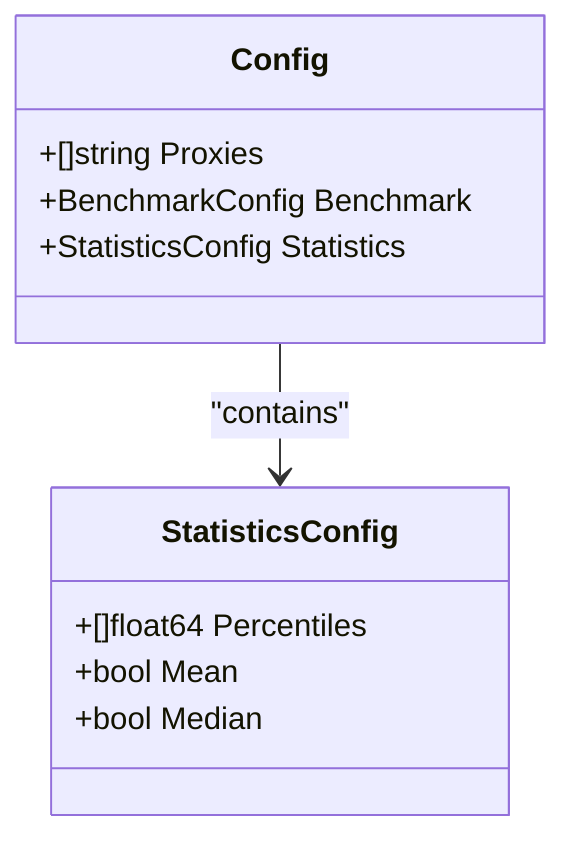
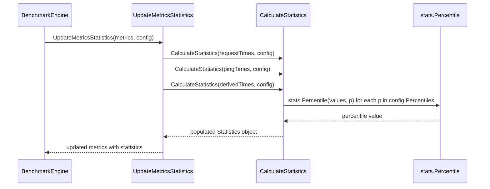
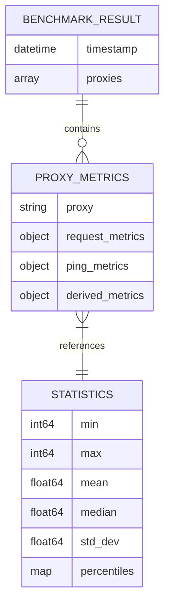

# Statistics Configuration

<cite>
**Referenced Files in This Document**  
- [config.go](file://config.go)
- [statistics.go](file://statistics.go)
- [config.example.json](file://config.example.json)
- [metrics.go](file://metrics.go)
- [reporter.go](file://reporter.go)
</cite>

## Table of Contents
1. [Introduction](#introduction)
2. [StatisticsConfig Structure](#statisticsconfig-structure)
3. [Percentiles Configuration](#percentiles-configuration)
4. [Statistical Calculations Implementation](#statistical-calculations-implementation)
5. [Results Output Format](#results-output-format)
6. [Configuration Examples](#configuration-examples)
7. [Best Practices and Recommendations](#best-practices-and-recommendations)
8. [Common Misconfigurations](#common-misconfigurations)

## Introduction
The statistics configuration system enables detailed performance analysis by calculating key metrics from benchmark results. This document explains how the `StatisticsConfig` struct controls statistical calculations, particularly percentile analysis and core descriptive statistics. The configuration directly influences the quality and depth of insights available in final reports.

## StatisticsConfig Structure
The `StatisticsConfig` struct defines which statistical measures should be calculated during benchmark analysis. It is a component of the main application configuration and controls post-processing of timing data collected during benchmark execution.



**Diagram sources**  
- [config.go](file://config.go#L25-L29)

**Section sources**  
- [config.go](file://config.go#L25-L29)

## Percentiles Configuration
The `Percentiles` field accepts an array of float64 values representing percentile ranks to calculate (e.g., [50, 75, 90, 95, 99]). When specified, the system computes response time percentiles using the `github.com/montanaflynn/stats` library's `Percentile` function.

Each requested percentile triggers calculation of the corresponding value from the dataset, providing insight into tail latency behavior. For example, a 99th percentile value indicates that 99% of all measured response times were at or below this threshold, making it crucial for understanding worst-case performance scenarios.

The calculated percentiles are stored as string-keyed values in the output (e.g., "90.0", "95.0") for JSON serialization compatibility.

**Section sources**  
- [statistics.go](file://statistics.go#L45-L52)
- [metrics.go](file://metrics.go#L44)

## Statistical Calculations Implementation
Statistical calculations are performed by the `CalculateStatistics` function, which processes timing data based on the provided `StatisticsConfig`. The implementation converts raw int64 millisecond values to float64 for compatibility with the stats library.

Core metrics always calculated include:
- Minimum (`Min`) and maximum (`Max`) values
- Standard deviation (`StdDev`)

Conditional calculations based on configuration flags:
- Mean (average) when `Mean` flag is true
- Median (middle value) when `Median` flag is true
- Requested percentiles when `Percentiles` array contains values

The `UpdateMetricsStatistics` function orchestrates statistics calculation across all metric types (request, ping, and derived metrics) for each proxy.



**Diagram sources**  
- [statistics.go](file://statistics.go#L8-L60)

**Section sources**  
- [statistics.go](file://statistics.go#L8-L60)

## Results Output Format
Statistical results are integrated into the final JSON reports through the `BenchmarkResult` and `ShortSummary` structures. The full report (`result.json`) includes complete statistical details for all metrics, while the short summary (`results_short.json`) focuses on mean values for quick comparison.

In the full result file, statistics appear nested within each proxy's metrics:
```json
"statistics": {
  "min": 123,
  "max": 2456,
  "mean": 456.7,
  "median": 398.5,
  "std_dev": 234.1,
  "percentiles": {
    "90.0": 678.2,
    "95.0": 890.1,
    "99.0": 1234.5
  }
}
```

The short summary only includes the mean value per proxy, enabling rapid performance comparisons across multiple proxies without the detail overhead.



**Diagram sources**  
- [reporter.go](file://reporter.go#L9-L12)
- [metrics.go](file://metrics.go#L40-L44)

**Section sources**  
- [reporter.go](file://reporter.go#L9-L23)
- [metrics.go](file://metrics.go#L29-L44)

## Configuration Examples
The `config.example.json` file demonstrates typical percentile configurations focused on performance monitoring:

```json
"statistics": {
  "percentiles": [90, 95, 99],
  "mean": true,
  "median": true
}
```

This configuration provides:
- **90th percentile**: Typical user experience threshold
- **95th percentile**: Performance degradation detection
- **99th percentile**: Outlier and failure scenario identification

Alternative configurations might include:
- `[50, 75, 90]` for general performance profiling
- `[95, 99, 99.9]` for strict SLO monitoring requiring high reliability
- `[99.9]` for ultra-low-latency requirements

Custom percentile sets allow teams to align measurements with specific service level objectives and business requirements.

**Section sources**  
- [config.example.json](file://config.example.json#L17-L19)

## Best Practices and Recommendations
For effective statistical analysis:

**SLO Monitoring**: Use higher percentiles (95, 99, 99.9) to capture tail latency that impacts user experience. These values often reveal issues not apparent in average metrics.

**Performance Profiling**: Include median and lower percentiles (50, 75, 90) to understand central tendency and common-case performance patterns.

**Resource Efficiency**: Limit percentile calculations to essential values, as each additional percentile requires separate computation. The current implementation has minimal overhead due to efficient sorting in the underlying library.

**Data Interpretation**: Always consider standard deviation alongside mean values to assess result consistency. High standard deviation with acceptable mean suggests unstable performance.

**Reporting Strategy**: Use the full `result.json` for deep analysis and troubleshooting, while leveraging `results_short.json` for automated monitoring and alerting systems.

## Common Misconfigurations
Potential configuration pitfalls include:

**Empty Percentiles Array**: Specifying `"percentiles": []` results in no percentile calculations despite the field being present. To disable percentiles completely, omit the field or ensure the array is nil.

**Overly Granular Percentiles**: Requesting numerous percentiles (e.g., every 5%) provides diminishing returns and increases output size without significant analytical benefit.

**Misunderstanding Outlier Impact**: The current implementation does not automatically exclude outliers. Extreme values will affect all statistical measures including mean and percentiles. Consider preprocessing data or using robust statistical measures when outlier presence is expected.

**Inconsistent Metric Selection**: Disabling both mean and median while keeping percentiles may leave users without central tendency reference points, making percentile interpretation more difficult.

Always validate configuration files against expected schema and test with sample data to ensure desired statistical outputs are generated.