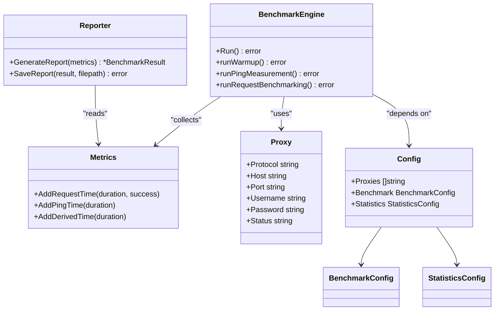

# Development Guide

<cite>
**Referenced Files in This Document**   
- [Makefile](file://Makefile)
- [main.go](file://main.go)
- [config.go](file://config.go)
- [metrics.go](file://metrics.go)
- [metrics_test.go](file://metrics_test.go)
- [reporter.go](file://reporter.go)
- [benchmark.go](file://benchmark.go)
- [proxy.go](file://proxy.go)
- [go.mod](file://go.mod)
- [env_config.go](file://env_config.go) - *Added in commit be33545*
- [test_with_env.sh](file://test_with_env.sh) - *Added in commit be33545*
</cite>

## Update Summary
**Changes Made**   
- Added new section on environment-based testing workflow
- Updated Testing Strategy section to include environment configuration details
- Enhanced Local Development Setup with environment variable guidance
- Added references to new files: env_config.go and test_with_env.sh
- Updated contribution process to reflect new testing infrastructure

## Table of Contents
1. [Development Workflow](#development-workflow)
2. [Testing Strategy](#testing-strategy)
3. [Code Organization and Conventions](#code-organization-and-conventions)
4. [Local Development Setup](#local-development-setup)
5. [Contribution Process](#contribution-process)
6. [Extensibility Points](#extensibility-points)
7. [Dependency Management](#dependency-management)

## Development Workflow

The proxy-benchmark project uses a Makefile-driven development workflow to streamline common tasks such as building, testing, and cleaning artifacts. The primary targets are designed for ease of use and consistency across development environments.

To build the application, execute:
```bash
make build
```
This compiles the Go source code into an executable binary named `proxy-benchmark` using the standard Go build command. The target references `main.go` as the entry point and outputs the binary in the current directory.

To run all unit tests with verbose output:
```bash
make test
```
This executes `go test -v ./...`, running all test files recursively throughout the project. It is the primary method for validating code changes and ensuring functionality remains intact.

For comprehensive test coverage analysis:
```bash
make test-cover
```
This generates a coverage profile (`coverage.out`) and opens an HTML report in your browser, allowing you to assess which parts of the codebase are exercised by tests.

Additional utility targets include:
- `make fmt`: Formats all Go files using `go fmt`
- `make vet`: Runs `go vet` to detect potential correctness issues
- `make clean`: Removes the compiled binary artifact
- `make deps`: Ensures dependencies are synchronized via `go mod tidy`
- `make build-all`: Produces binaries for Linux, Windows, and macOS platforms

These targets support a consistent, repeatable development process that integrates seamlessly with CI/CD pipelines.

**Section sources**
- [Makefile](file://Makefile#L1-L51)

## Testing Strategy

Unit testing in the proxy-benchmark codebase focuses on validating core metrics collection, statistical calculations, and configuration loading. The test suite ensures reliability of performance measurement and data processing logic.

To run unit tests specifically for the metrics package:
```bash
go test -v ./metrics.go ./metrics_test.go
```
Alternatively, run all tests in the project:
```bash
make test
```

The `metrics_test.go` file contains comprehensive test cases verifying correct behavior of the `Metrics` struct and its methods. Key aspects tested include:
- Proper counting of successful, failed, and total requests
- Accurate storage of request, ping, and derived timing data
- Thread-safe operations via mutex protection during concurrent access
- Correct calculation of statistics including mean, median, percentiles, min, max, and standard deviation

When writing new tests for added functionality, follow the existing pattern in `metrics_test.go`. Each test should:
1. Initialize required components (e.g., `NewMetrics("test-proxy")`)
2. Simulate input conditions (e.g., add request times with varying success status)
3. Assert expected outcomes using `t.Errorf` for failures
4. Cover both normal operation and edge cases (e.g., empty datasets)

Test functions should be named descriptively (e.g., `TestStatisticsCalculation`) and grouped by feature area. Use subtests when appropriate to organize related scenarios.

All tests must be placed in `_test.go` files alongside their corresponding implementation files to maintain locality and simplify discovery.

### Environment-Based Testing

The project now supports environment-based testing through dedicated helper functions and scripts. This enables testing with real proxy credentials while keeping sensitive information out of version control.

Key components:
- `env_config.go`: Contains helper functions for loading test configurations with environment variable support
- `test_with_env.sh`: Shell script that demonstrates how to run tests with environment-based configuration
- `.env.example`: Template file showing required environment variables

The `GetTestProxies` function in `env_config.go` retrieves proxies from the `TEST_PROXIES` environment variable, falling back to predefined values if not set. This allows developers to override default test proxies with their own configurations.

Three test configuration loaders are provided:
- `LoadTestConfig()`: General test configuration with multiple proxy types
- `LoadGitHubTestConfig()`: Configuration for testing against GitHub API
- `LoadJSONPlaceholderTestConfig()`: Configuration for testing against JSONPlaceholder API

To run environment-based tests:
1. Copy the example environment file: `cp .env.example .env`
2. Edit `.env` with your actual proxy credentials
3. Run the test script: `./test_with_env.sh`

The script automatically substitutes environment variables into JSON templates and runs integration tests against external APIs. It includes safeguards to prevent accidental use of example proxies for real testing.

**Section sources**
- [metrics_test.go](file://metrics_test.go#L1-L92)
- [metrics.go](file://metrics.go#L1-L123)
- [statistics.go](file://statistics.go#L8-L53)
- [env_config.go](file://env_config.go#L9-L85) - *Added in commit be33545*
- [test_with_env.sh](file://test_with_env.sh#L1-L105) - *Added in commit be33545*

## Code Organization and Conventions

The codebase follows a flat, single-package structure where all Go files reside in the main module without subpackages. This simplifies imports and reduces complexity for a focused utility tool.

Key naming conventions:
- Structs use PascalCase: `BenchmarkEngine`, `ProxyMetrics`, `StatisticsConfig`
- Methods and functions use camelCase: `AddRequestTime`, `CalculateStatistics`
- Public fields and methods are capitalized; private ones are lowercase
- Configuration structs mirror JSON field names using struct tags: `json:"requests"`

Logging practices emphasize clarity and progress tracking:
- `fmt.Println` is used for stage progression messages (e.g., "Initializing benchmark engine...")
- `fmt.Printf` provides contextual information with formatted values (e.g., proxy addresses, errors)
- `log.Fatalf` terminates execution on unrecoverable errors, providing clear diagnostic output

Data structures are organized around key domains:
- `Config` and `BenchmarkConfig` manage runtime settings from JSON
- `Metrics` and related types track performance measurements
- `BenchmarkEngine` orchestrates the benchmark lifecycle
- `Reporter` handles result serialization

Each component maintains separation of concerns while operating within the same package. This design enables straightforward navigation and modification without complex import chains.

**Section sources**
- [main.go](file://main.go#L1-L82)
- [config.go](file://config.go#L1-L49)
- [metrics.go](file://metrics.go#L1-L123)
- [reporter.go](file://reporter.go#L1-L100)

## Local Development Setup

To set up a local development environment for proxy-benchmark:

1. Install Go version 1.23 or higher (the project specifies `go 1.23.0` in go.mod).
2. Clone the repository to your GOPATH or any directory.
3. Navigate to the project root and verify module integrity:
   ```bash
   go mod tidy
   ```
4. Build the binary:
   ```bash
   make build
   ```
5. Run the benchmark using the example config:
   ```bash
   cp config.example.json config.json
   ./proxy-benchmark --config=config.json
   ```

For testing with real proxy credentials, set up environment variables:
```bash
cp .env.example .env
# Edit .env with your proxy credentials
export $(grep -v '^#' .env | xargs)
```

Ensure your `GOPROXY` environment variable is configured appropriately if behind a corporate firewall. The project relies on two indirect dependencies:
- `github.com/montanaflynn/stats` for statistical calculations
- `golang.org/x/net` for network-related utilities

No additional setup is required beyond standard Go tooling. The application reads configuration from a JSON file and writes results to `result.json` and `results_short.json`.

**Section sources**
- [go.mod](file://go.mod#L1-L11)
- [main.go](file://main.go#L1-L82)
- [config.go](file://config.go#L32-L47)
- [.env.example](file://.env.example) - *Added in commit be33545*

## Contribution Process

Contributions to the proxy-benchmark project follow a standard Git-based workflow:

1. Create a new feature branch from `main`:
   ```bash
   git checkout -b feature/new-proxy-type
   ```
2. Implement changes with comprehensive tests.
3. Format code and run linters:
   ```bash
   make fmt vet
   ```
4. Test locally:
   ```bash
   make test
   ```
5. Commit changes with descriptive messages.
6. Push the branch and open a pull request (PR).

Pull requests must:
- Include unit tests for new functionality
- Maintain backward compatibility
- Follow existing code style and naming conventions
- Pass all CI checks (build, test, vet, fmt)
- Contain a clear description of changes and motivation

For contributions involving proxy validation, include tests that verify response validation functionality. When adding new test configurations, follow the pattern established in `env_config.go` and provide appropriate documentation.

Code review criteria include:
- Correctness and robustness of implementation
- Adequacy of test coverage
- Clarity of code and comments
- Adherence to project architecture
- Performance implications

Maintainers will provide feedback and may request revisions before merging. Once approved, PRs are squashed and merged into `main`.

**Section sources**
- [Makefile](file://Makefile#L1-L51)
- [metrics_test.go](file://metrics_test.go#L1-L92)
- [validation_test.go](file://validation_test.go#L1-L418) - *Updated in commit be33545*

## Extensibility Points

The current architecture supports extension in several key areas:

### Adding New Proxy Protocols
The `ParseProxy` function in `proxy.go` constructs `Proxy` instances from string representations. To support new protocols:
1. Extend the protocol parsing logic to recognize new schemes
2. Implement corresponding client creation in `benchmark.go`'s `runWarmup` and `runRequestBenchmarking` phases
3. Add protocol-specific error handling and logging

Currently, HTTP and SOCKS5 clients are supported through conditional checks on `proxy.Protocol`. New protocols can be integrated similarly by branching on the protocol field.

### Supporting Additional Output Formats
The `Reporter` type in `reporter.go` currently generates JSON reports. To add new formats:
1. Extend the `Reporter` with new methods like `SaveReportCSV` or `SaveReportYAML`
2. Introduce format selection via configuration or command-line flags
3. Register new output targets in the main execution flow

The `GenerateReport` and `GenerateShortSummary` methods already abstract the data model from serialization, making it easier to introduce alternative encodings.

### Enhancing Metrics Collection
Custom metrics can be added by extending the `Metrics` struct with new fields and synchronization mechanisms. Derived metrics (like processing time) demonstrate how computed values can be stored alongside raw measurements.

Architectural considerations:
- All metrics are thread-safe via embedded `sync.Mutex`
- Statistics are calculated post-hoc using configurable parameters
- Configuration is decoupled from execution via the `Config` struct

These extensibility points allow developers to enhance functionality without disrupting core benchmarking logic.



**Diagram sources**
- [benchmark.go](file://benchmark.go#L10-L75)
- [metrics.go](file://metrics.go#L1-L123)
- [reporter.go](file://reporter.go#L1-L100)
- [config.go](file://config.go#L1-L49)
- [proxy.go](file://proxy.go#L8-L32)

**Section sources**
- [benchmark.go](file://benchmark.go#L10-L75)
- [proxy.go](file://proxy.go#L18-L32)
- [reporter.go](file://reporter.go#L32-L34)

## Dependency Management

Dependencies are managed through Go modules as defined in `go.mod`. The project specifies Go 1.23 as the minimum version and uses toolchain directive `go1.24.6` for consistent builds.

Current dependencies:
- `github.com/montanaflynn/stats v0.7.1` – Used for calculating statistical metrics (mean, median, percentiles, etc.)
- `golang.org/x/net v0.43.0` – Provides low-level networking utilities, particularly for SOCKS5 support

Both are indirect dependencies, meaning they are imported by packages within the standard library or other transitive dependencies rather than directly by this project.

To update dependencies:
```bash
go get -u ./...
make deps
```

Version compatibility is ensured through:
- Pinning specific Go versions in `go.mod`
- Using semantic versioning for external modules
- Regular updates via `go mod tidy` and `go get -u`

Developers should avoid introducing direct dependencies unless absolutely necessary, preferring standard library solutions when available. Any new dependency must be justified and reviewed for security, maintenance status, and license compatibility.

**Section sources**
- [go.mod](file://go.mod#L1-L11)
- [statistics.go](file://statistics.go#L8-L53)