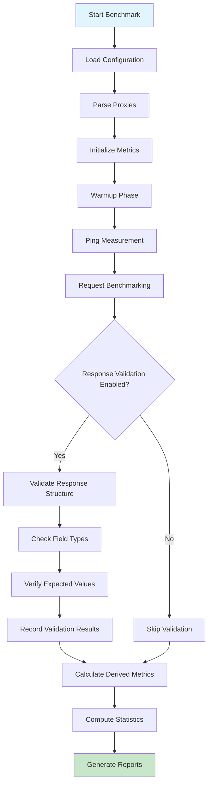

# Examples & Use Cases

<cite>
**Referenced Files in This Document**   
- [config.example.json](file://config.example.json) - *Updated with response validation example*
- [test-config.json](file://test-config.json) - *Base configuration for advanced scenarios*
- [env_config.go](file://env_config.go) - *Added in commit c4f6ff14b113f82030e9941855e1135fb4503df7*
- [config.go](file://config.go) - *Modified to include ResponseValidation structure*
- [benchmark.go](file://benchmark.go) - *Updated with validateResponse implementation*
- [validation_test.go](file://validation_test.go) - *Added test cases for response validation*
- [test-configs/github-api-config.json](file://test-configs/github-api-config.json) - *New example configuration*
- [test-configs/jsonplaceholder-config.json](file://test-configs/jsonplaceholder-config.json) - *New example configuration*
</cite>

## Table of Contents
1. [Basic Usage Example](#basic-usage-example)
2. [Advanced Configuration Scenarios](#advanced-configuration-scenarios)
3. [Real-World Use Cases](#real-world-use-cases)
4. [Configuration Parameters and Their Impact](#configuration-parameters-and-their-impact)
5. [Best Practices for Benchmark Design](#best-practices-for-benchmark-design)

## Basic Usage Example

To begin using proxy-benchmark, start by copying the configuration template to create your working configuration file:

```bash
cp config.example.json config.json
```

The default configuration includes sample proxies with the required format: `protocol:host:port:username:password:status`. After customizing the proxy list with your actual proxy servers, execute the benchmark using the default settings:

```bash
./proxy-benchmark
```

This command loads `config.json`, initializes the benchmark engine, and runs through all phases: warmup, ping measurement, request benchmarking, and statistical analysis. The tool automatically applies sensible defaults when values are missing or set to zero, as defined in [main.go](file://main.go#L20-L45). Upon completion, two output files are generated: `result.json` containing comprehensive metrics and `results_short.json` providing a concise summary of mean performance per proxy.

**Section sources**
- [config.example.json](file://config.example.json#L1-L19)
- [main.go](file://main.go#L15-L80)

## Advanced Configuration Scenarios

For more sophisticated testing scenarios, utilize alternative configuration files such as `test-config.json` which demonstrates enhanced settings for rigorous evaluation. This configuration enables testing in mixed protocol environments by including both SOCKS5 and HTTP proxies, allowing direct comparison of different proxy types under identical conditions.

When evaluating large proxy pools, adjust the `concurrency` parameter to control resource usage. Higher concurrency values enable faster execution but consume more system resources. For statistically significant results in large-scale evaluations, increase the `requests` parameter to gather more data points, improving the reliability of calculated percentiles and standard deviations.

Custom statistical analysis can be configured by modifying the `percentiles` array in the statistics section. Adding additional percentile values (e.g., 75, 85) provides finer-grained insight into performance distribution across requests. Disabling unnecessary calculations (setting `mean` or `median` to false) can slightly improve post-processing efficiency for massive datasets.

A new feature introduced in the latest update is **response validation**, which allows you to verify that the responses from your target endpoints meet specific criteria. This is particularly useful when testing APIs where response structure and content are critical.

For example, when testing against the GitHub API, you can configure validation checks to ensure the response contains expected fields and values:

```json
{
  "proxies": ["http:proxy.example.com:8080:username:password:enabled"],
  "benchmark": {
    "target_url": "https://api.github.com/users/octocat",
    "response_validation": {
      "enabled": true,
      "checks": [
        {"path": "login", "type": "string", "value": "octocat"},
        {"path": "id", "type": "number"},
        {"path": "type", "type": "string", "value": "User"},
        {"path": "site_admin", "type": "boolean"},
        {"path": "public_repos", "type": "number"}
      ]
    }
  }
}
```

Similarly, when testing JSONPlaceholder endpoints, you can validate response structure:

```json
{
  "proxies": ["http:proxy.example.com:8080:username:password:enabled"],
  "benchmark": {
    "target_url": "https://jsonplaceholder.typicode.com/posts/1",
    "response_validation": {
      "enabled": true,
      "checks": [
        {"path": "userId", "type": "number"},
        {"path": "id", "type": "number", "value": 1},
        {"path": "title", "type": "string"},
        {"path": "body", "type": "string"}
      ]
    }
  }
}
```

The response validation system supports:
- **Nested field access** using dot notation (e.g., `user.profile.verified`)
- **Type checking** for string, number, boolean, and array types
- **Value matching** to verify specific expected values
- **Optional fields** where only type is checked but value can vary

These validation configurations are available in the example files `test-configs/github-api-config.json` and `test-configs/jsonplaceholder-config.json`.



**Diagram sources**
- [benchmark.go](file://benchmark.go#L318-L361) - *validateResponse implementation*
- [config.go](file://config.go#L27-L37) - *ResponseValidation and ValidationCheck structures*

**Section sources**
- [test-config.json](file://test-config.json#L1-L19)
- [benchmark.go](file://benchmark.go#L39-L75)
- [statistics.go](file://statistics.go#L56-L60)
- [env_config.go](file://env_config.go#L47-L77) - *GitHub test configuration*
- [env_config.go](file://env_config.go#L79-L108) - *JSONPlaceholder test configuration*

## Real-World Use Cases

### Evaluating Residential vs. Datacenter Proxies

Configure separate benchmark runs for residential and datacenter proxy providers using distinct configuration files. Compare not only raw performance metrics but also consistency (standard deviation) and tail latency (P99). Residential proxies typically show higher average latency but better success rates when accessing geo-restricted content, while datacenter proxies offer superior speed and lower variance.

With the new response validation feature, you can also verify that residential proxies successfully retrieve content that might be blocked for datacenter IPs. For example, when testing against a geo-restricted API, configure validation checks to ensure the expected regional content is returned.

### Monitoring Service Degradation Over Time

Schedule periodic benchmark executions against the same proxy provider using identical configurations. Track changes in key metrics over time by analyzing historical `results_short.json` files. Increasing P95/P99 values indicate growing tail latency issues, while decreasing success rates may signal capacity problems at the provider level.

Enhance this monitoring by incorporating response validation to detect subtle service degradation. For instance, an API might continue to respond but start returning incomplete data or different response formats. By validating specific fields and their types/values, you can catch these issues early.

### Stress-Testing Failover Mechanisms

Design configurations with intentionally unreliable proxies (using known unstable endpoints) alongside primary proxies. Configure high request counts with moderate intervals to simulate sustained load. Analyze whether backup proxies maintain acceptable performance when primary routes fail, verifying that failover mechanisms preserve service quality during network disruptions.

Use response validation to ensure that failover doesn't compromise data integrity. Even if requests succeed through backup proxies, the responses should maintain the same structure and content quality as those from primary proxies.

```mermaid
classDiagram
class Config {
+[]string Proxies
+BenchmarkConfig Benchmark
+StatisticsConfig Statistics
}
class BenchmarkConfig {
+int Requests
+int IntervalMs
+int WarmupRequests
+string TargetURL
+int Concurrency
+int TimeoutMs
+ResponseValidation ResponseValidation
+bool OutputResponse
}
class ResponseValidation {
+bool Enabled
+[]ValidationCheck Checks
}
class ValidationCheck {
+string Path
+string Type
+interface{} Value
}
class StatisticsConfig {
+[]float64 Percentiles
+bool Mean
+bool Median
}
class Metrics {
+string ProxyString
+RequestMetrics RequestMetrics
+PingMetrics PingMetrics
+DerivedMetrics DerivedMetrics
}
Config --> BenchmarkConfig : "contains"
BenchmarkConfig --> ResponseValidation : "optional reference"
ResponseValidation --> ValidationCheck : "contains"
Metrics --> RequestMetrics : "contains"
Metrics --> PingMetrics : "contains"
Metrics --> DerivedMetrics : "contains"
```

**Diagram sources**
- [config.go](file://config.go#L8-L29) - *Config and related structures*
- [metrics.go](file://metrics.go#L8-L45) - *Metrics structure*

**Section sources**
- [benchmark.go](file://benchmark.go#L10-L15)
- [reporter.go](file://reporter.go#L37-L54)
- [reporter.go](file://reporter.go#L57-L72)
- [validation_test.go](file://validation_test.go#L0-L418) - *Comprehensive validation test cases*

## Configuration Parameters and Their Impact

Key parameters significantly influence benchmark outcomes and interpretation:

- **benchmark.requests**: Increasing this value improves statistical reliability by providing larger sample sizes for calculating percentiles and standard deviation. More requests yield more stable metrics but extend execution time proportionally.

- **benchmark.interval_ms**: Controls pacing between requests. Shorter intervals simulate heavier loads and can reveal rate limiting or throttling behaviors. Longer intervals provide cleaner measurements of individual request performance without interference from previous requests.

- **benchmark.warmup_requests**: Ensures connections are established and caches warmed before collecting metrics. Insufficient warmup may skew results due to initial connection overhead, especially noticeable with TLS handshakes on HTTPS proxies.

- **statistics.percentiles**: Customizable percentile calculation allows focus on specific performance thresholds relevant to use cases. For real-time applications, P95/P99 become critical indicators of user experience quality.

- **benchmark.concurrency**: Governs parallel execution across proxies. Higher values accelerate benchmark completion but require more system resources. Optimal settings depend on available CPU, memory, and network bandwidth.

- **benchmark.response_validation**: New parameter that enables structural validation of API responses. When enabled, the benchmark verifies that responses contain expected fields with correct types and values. This adds confidence that proxies are not just connecting but also delivering complete and correct content.

- **validation_check.path**: Supports dot notation for nested JSON fields (e.g., `user.profile.verified`). This allows validation of complex API responses with hierarchical data structures.

- **validation_check.type**: Validates the data type of response fields (string, number, boolean, array). This helps detect API changes or proxy-induced data corruption.

- **validation_check.value**: Optional exact value matching for critical fields. Useful for verifying authentication status, user IDs, or other invariant values.

These parameters interact complexly—increasing both requests and concurrency dramatically increases total system load, potentially exposing resource bottlenecks in the testing environment itself.

**Section sources**
- [config.go](file://config.go#L15-L22)
- [main.go](file://main.go#L20-L45)
- [benchmark.go](file://benchmark.go#L18-L36)
- [env_config.go](file://env_config.go#L47-L108) - *Example validation configurations*

## Best Practices for Benchmark Design

Design meaningful benchmarks by following these guidelines:

1. **Use Representative Target URLs**: Select endpoints similar to actual usage patterns. Testing against httpbin.org provides consistency, but production-like targets yield more applicable results.

2. **Ensure Adequate Sample Sizes**: Aim for minimum 50-100 requests per proxy to achieve reliable statistical measures. Larger samples reduce variance in calculated metrics.

3. **Account for Network Variability**: Run benchmarks multiple times across different times of day to capture temporal variations in network conditions.

4. **Validate Proxy Credentials**: Ensure all proxy credentials are correct and active before starting benchmarks to avoid misclassifying valid performance issues as authentication failures.

5. **Monitor System Resources**: Keep an eye on CPU, memory, and network usage during high-concurrency runs to ensure the test environment isn't becoming the bottleneck.

6. **Interpret Results Contextually**: Consider business requirements when evaluating metrics. A slightly slower proxy with higher uptime may be preferable to a faster but less reliable alternative.

7. **Document Configuration Changes**: Maintain version-controlled copies of configuration files used in each benchmark run to enable accurate comparisons over time.

8. **Implement Response Validation for Critical APIs**: When testing API endpoints, always include response validation to ensure data integrity. This catches issues where requests succeed but return malformed or incorrect data.

9. **Test with Realistic Data Structures**: Use validation checks that reflect your actual data schema, including nested objects and arrays. This provides more comprehensive coverage than simple flat-field validation.

10. **Balance Validation Complexity**: While thorough validation is valuable, excessive checks can slow down the benchmark process. Focus on critical fields that impact business logic.

By adhering to these practices, users can generate actionable insights from benchmark results that accurately reflect real-world proxy performance characteristics.

**Section sources**
- [main.go](file://main.go#L50-L80)
- [benchmark.go](file://benchmark.go#L78-L276)
- [reporter.go](file://reporter.go#L75-L98)
- [metrics.go](file://metrics.go#L48-L61)
- [validation_test.go](file://validation_test.go#L0-L418) - *Validation best practices demonstrated in tests*