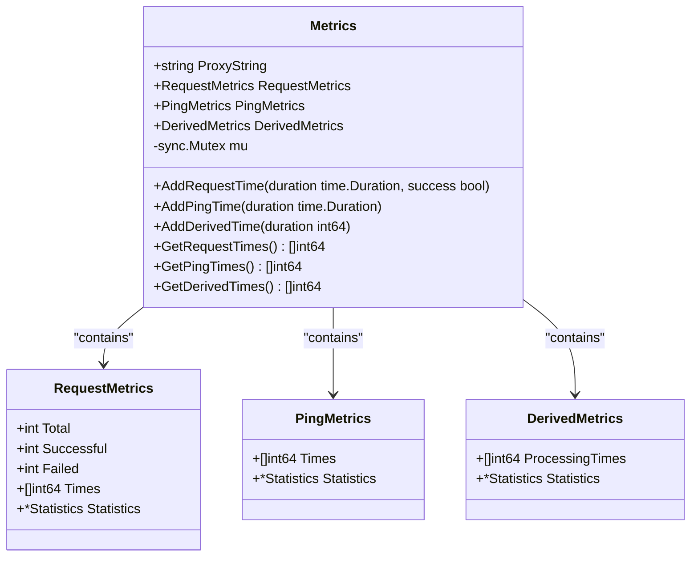
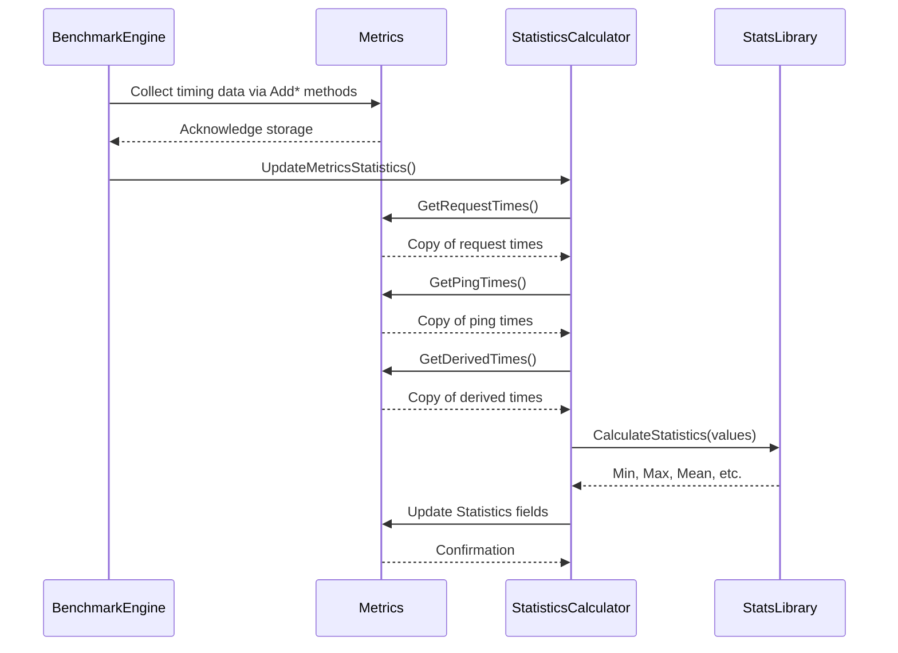
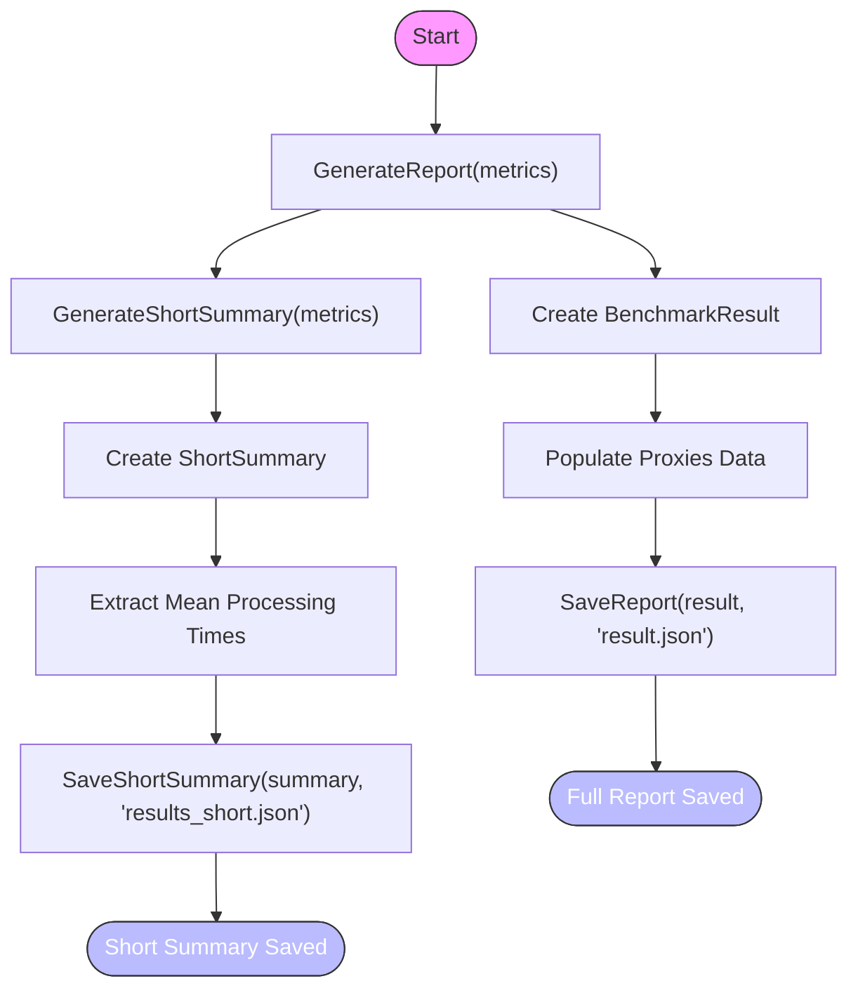

# Metrics & Results

<cite>
**Referenced Files in This Document**   
- [metrics.go](file://metrics.go)
- [statistics.go](file://statistics.go)
- [reporter.go](file://reporter.go)
- [config.go](file://config.go)
- [result.json](file://result.json)
- [results_short.json](file://results_short.json)
</cite>

## Table of Contents
1. [Metrics Collection](#metrics-collection)
2. [Statistical Analysis](#statistical-analysis)
3. [Reporting Mechanisms](#reporting-mechanisms)
4. [Result Interpretation](#result-interpretation)
5. [Data Accuracy and Performance](#data-accuracy-and-performance)

## Metrics Collection

The metrics collection system is centered around the `Metrics` struct defined in `metrics.go`, which serves as a thread-safe container for timing data collected during proxy benchmarking operations. The struct incorporates a `sync.Mutex` field (`mu`) to ensure safe concurrent access when multiple goroutines are recording performance measurements.

The `Metrics` struct organizes collected data into three primary categories:
- **RequestMetrics**: Tracks HTTP request performance including total, successful, and failed request counts, along with individual request durations
- **PingMetrics**: Records network latency measurements obtained through ping operations
- **DerivedMetrics**: Contains processing times calculated by subtracting round-trip ping time from total request time

Thread safety is maintained through synchronized methods that lock the mutex before modifying internal state. The `AddRequestTime`, `AddPingTime`, and `AddDerivedTime` methods all acquire the mutex lock before appending new timing measurements to their respective slices, preventing race conditions during concurrent writes from multiple benchmarking threads.

For data retrieval, the system provides getter methods (`GetRequestTimes`, `GetPingTimes`, `GetDerivedTimes`) that return copies of the internal timing slices rather than direct references. This design prevents external code from inadvertently modifying the original data while ensuring consistent state during read operations.

**Diagram sources**
- [metrics.go](file://metrics.go#L8-L14)

**Section sources**
- [metrics.go](file://metrics.go#L8-L122)
- [metrics.go](file://metrics.go#L64-L91)

## Statistical Analysis

Statistical analysis of collected metrics is performed by the `CalculateStatistics` function in `statistics.go`, which leverages the montanaflynn/stats library to compute comprehensive statistical measures from timing data. The analysis process converts raw integer millisecond values to floating-point numbers required by the statistics library, then calculates key metrics based on configuration settings.

The system computes the following statistical values:
- **Min/Max**: Extreme values representing best and worst-case performance
- **Mean**: Average value providing central tendency measurement
- **Median**: Middle value offering robust central tendency resistant to outliers
- **Standard Deviation**: Measure of data dispersion indicating consistency
- **Custom Percentiles**: Configurable percentile values (e.g., 90th, 95th, 99th) crucial for understanding tail latency

The calculation process is configurable through the `StatisticsConfig` struct, allowing users to enable or disable specific statistical computations based on performance requirements and analytical needs. This selective computation helps optimize resource usage when certain metrics are not required.

The `UpdateMetricsStatistics` function orchestrates the statistical analysis by invoking `CalculateStatistics` for each category of metrics (request, ping, and derived processing times), populating the corresponding `Statistics` objects within the main `Metrics` structure.

**Diagram sources**
- [statistics.go](file://statistics.go#L8-L53)
- [statistics.go](file://statistics.go#L56-L60)

**Section sources**
- [statistics.go](file://statistics.go#L8-L61)
- [config.go](file://config.go#L25-L29)

## Reporting Mechanisms

The reporting system, implemented in `reporter.go`, transforms collected metrics into structured JSON outputs for analysis and visualization. The `Reporter` type provides two distinct output formats through separate generation methods:

The `GenerateReport` method produces a comprehensive `BenchmarkResult` object containing complete timing data, statistical summaries, and metadata for all tested proxies. This detailed report is serialized to `result.json` and includes timestamps, full timing arrays, and complete statistical profiles.

Conversely, the `GenerateShortSummary` method creates a concise `ShortSummary` object that extracts only the most critical information—specifically the mean processing time for each proxy. This abbreviated format in `results_short.json` enables quick comparison and sorting of proxy performance without the overhead of processing large datasets.

Both report types are persisted using dedicated save methods (`SaveReport` and `SaveShortSummary`) that handle file creation, JSON encoding with proper indentation, and error propagation. The reporter maintains separation between data transformation and persistence concerns, adhering to single responsibility principles.

**Diagram sources**
- [reporter.go](file://reporter.go#L37-L54)
- [reporter.go](file://reporter.go#L75-L85)

**Section sources**
- [reporter.go](file://reporter.go#L1-L100)

## Result Interpretation

Interpreting the generated result files requires understanding both the detailed `result.json` and the summary `results_short.json` formats. The detailed report provides comprehensive insights into proxy performance characteristics, enabling deep analysis of various metrics.

Key performance indicators can be derived from the result files:
- **Success Rate**: Calculated as `(successful / total) * 100` from request metrics
- **Processing Time**: Represents actual proxy processing overhead after accounting for network latency
- **Latency Distribution**: Revealed through percentile analysis showing tail behavior

For example, examining the `result.json` file shows that the SOCKS proxy demonstrates significantly higher processing times (~2321ms mean) compared to HTTP proxies (~1300-1400ms range), indicating potentially different routing or processing mechanisms. The presence of zero ping times for several proxies suggests either extremely low latency connections or potential measurement limitations in the ping implementation.

Outlier detection can be performed by comparing standard deviation values across proxies. A high standard deviation relative to the mean indicates inconsistent performance. For instance, the proxy at 46.203.215.131:45414 shows a relatively high standard deviation of 42.5ms in processing time, suggesting unstable performance despite a reasonable mean of 1369.5ms.

The short summary file facilitates rapid ranking of proxies by mean processing time, making it ideal for automated selection systems. However, relying solely on mean values can mask important characteristics like high variance or poor tail latency, emphasizing the need to consult the full report for critical decisions.

**Section sources**
- [result.json](file://result.json)
- [results_short.json](file://results_short.json)

## Data Accuracy and Performance

The metrics collection system balances data accuracy with performance considerations through several design choices. The use of mutex-protected access ensures data integrity during concurrent operations but introduces potential contention under high load. Each metric addition requires acquiring and releasing the mutex, creating a serialization point that could become a bottleneck with extremely high request rates.

Data accuracy is maintained through careful handling of timing measurements, with durations converted to milliseconds for consistent representation. However, the system's accuracy is ultimately limited by the precision of the underlying timing functions and network conditions during measurement.

Performance implications of extensive metric collection include memory consumption proportional to the number of requests and proxies tested. Storing every individual timing measurement allows for comprehensive statistical analysis but requires significant memory for large-scale benchmarks. The system could implement sampling strategies or aggregation at collection time to reduce memory footprint when full granularity is not required.

The configurable statistical analysis through `StatisticsConfig` provides a mechanism to trade off computational overhead against analytical depth. Disabling median and percentile calculations reduces CPU usage, while enabling only essential statistics optimizes performance for scenarios where basic metrics suffice.

Overall, the system prioritizes accuracy and completeness over raw performance, making it suitable for benchmarking scenarios where comprehensive analysis is more important than minimal overhead. For production monitoring with strict performance requirements, modifications to the collection strategy might be necessary.

**Section sources**
- [metrics.go](file://metrics.go)
- [statistics.go](file://statistics.go)
- [config.go](file://config.go)