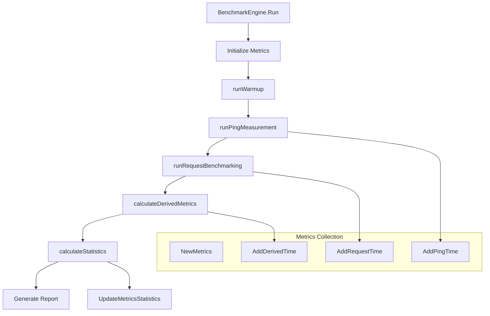
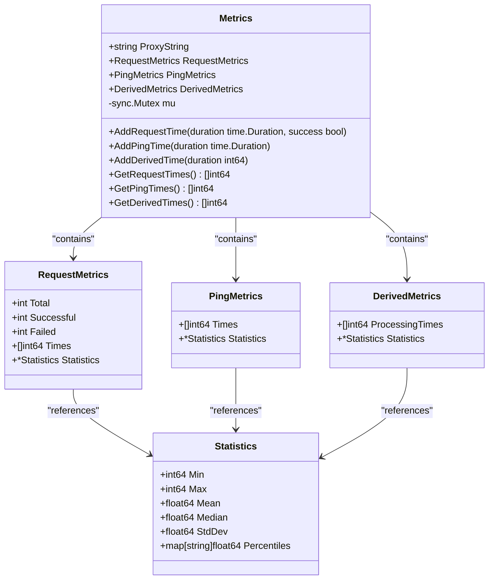
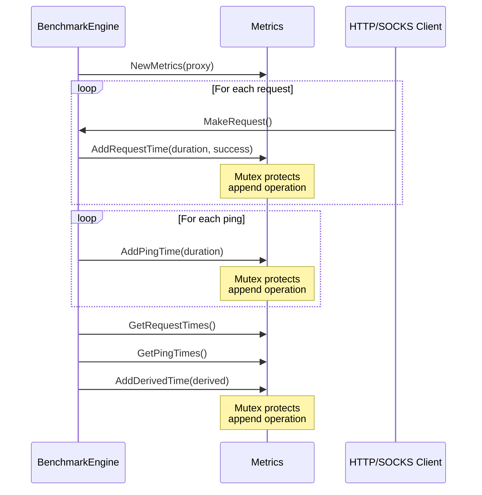
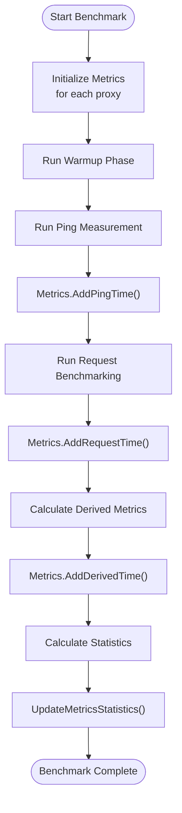

# Metrics Collection

<cite>
**Referenced Files in This Document **   
- [metrics.go](file://metrics.go)
- [benchmark.go](file://benchmark.go)
- [statistics.go](file://statistics.go)
</cite>

## Table of Contents
1. [Metrics Collection](#metrics-collection)
2. [Core Components](#core-components)
3. [Architecture Overview](#architecture-overview)
4. [Detailed Component Analysis](#detailed-component-analysis)
5. [Performance Considerations](#performance-considerations)

## Core Components

The metrics collection mechanism is centered around the `Metrics` struct defined in `metrics.go`, which serves as a thread-safe container for collecting and storing performance data during proxy benchmarking. The system collects three primary types of timing metrics: request durations, ping (TCP connection) times, and derived proxy processing times.

The `Metrics` struct incorporates a `sync.Mutex` field to ensure thread safety when multiple goroutines concurrently update metrics during high-concurrency benchmarking phases. This synchronization mechanism prevents race conditions that could corrupt data integrity when recording measurements from parallel operations.

Three supporting structs—`RequestMetrics`, `PingMetrics`, and `DerivedMetrics`—organize different categories of collected data, while the `Statistics` struct holds calculated statistical values such as minimum, maximum, mean, median, standard deviation, and configurable percentiles.

**Section sources**
- [metrics.go](file://metrics.go#L1-L122)

## Architecture Overview

The metrics collection system operates within a multi-phase benchmarking workflow orchestrated by the `BenchmarkEngine`. During execution, metrics are collected across distinct phases: warmup, ping measurement, and request benchmarking. Each phase contributes specific timing data that ultimately feeds into comprehensive performance analysis.

**Diagram sources **
- [benchmark.go](file://benchmark.go#L39-L75)
- [metrics.go](file://metrics.go#L48-L61)

## Detailed Component Analysis

### Metrics Struct Analysis

The `Metrics` struct serves as the central data container for all performance measurements associated with a single proxy. It maintains separate collections for different metric types and ensures thread-safe access through mutex synchronization.

#### Class Diagram of Metrics Structure

**Diagram sources **
- [metrics.go](file://metrics.go#L10-L45)

### Data Collection Workflow

The metrics system captures performance data at various stages of the benchmarking process, with each measurement type serving a specific analytical purpose.

#### Sequence Diagram of Metric Updates

**Diagram sources **
- [metrics.go](file://metrics.go#L64-L83)
- [benchmark.go](file://benchmark.go#L174-L187)

### Integration with Benchmarking Process

The metrics collection system is tightly integrated with the benchmarking engine, receiving timing data from various phases of execution. The `BenchmarkEngine.Run` method orchestrates the entire process, initializing metrics structures and coordinating data collection across concurrent goroutines.

During the ping measurement phase, direct TCP connection times to proxies are recorded using `AddPingTime`. In the request benchmarking phase, complete HTTP/SOCKS request durations are captured via `AddRequestTime`, including success/failure status. After raw data collection, derived metrics are calculated by subtracting twice the ping time from request times, representing the actual proxy processing overhead.

#### Flowchart of Metrics Lifecycle

**Diagram sources **
- [benchmark.go](file://benchmark.go#L39-L75)
- [metrics.go](file://metrics.go#L86-L95)

## Performance Considerations

The metrics collection system employs several design patterns to balance accuracy and performance under high-concurrency workloads. The use of `sync.Mutex` ensures data integrity but introduces potential contention points when numerous goroutines simultaneously attempt to update metrics.

Each metric update operation follows a consistent pattern: acquire mutex lock, modify the underlying slice or counter, then release the lock. While this approach guarantees thread safety, frequent updates in high-throughput scenarios may impact overall benchmark performance due to lock contention.

To mitigate these effects, the system minimizes critical section duration by performing only essential operations within locked regions—primarily appending to slices and incrementing counters. More intensive operations like statistical calculations are deferred until after data collection completes, reducing pressure on the mutex during active benchmarking phases.

The design also considers memory efficiency by pre-allocating slices where possible and avoiding unnecessary copying during read operations. When retrieving metric data for statistical analysis, copies are made to prevent blocking write operations, maintaining responsiveness even during report generation.

**Section sources**
- [metrics.go](file://metrics.go#L64-L95)
- [benchmark.go](file://benchmark.go#L240-L255)