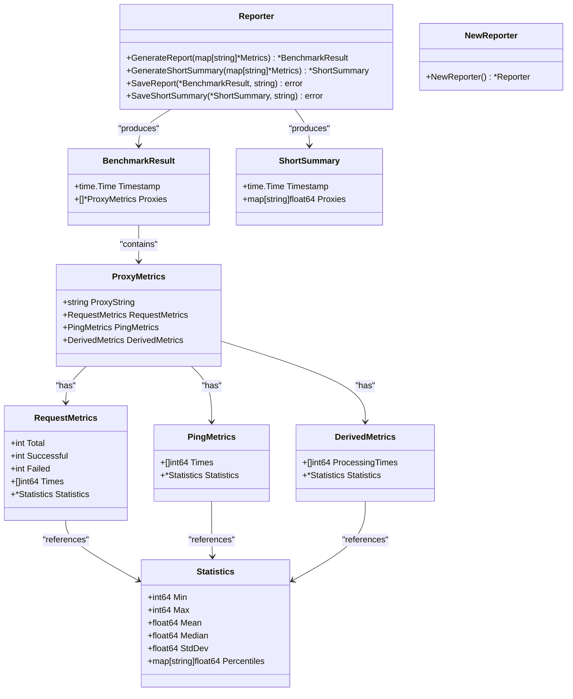
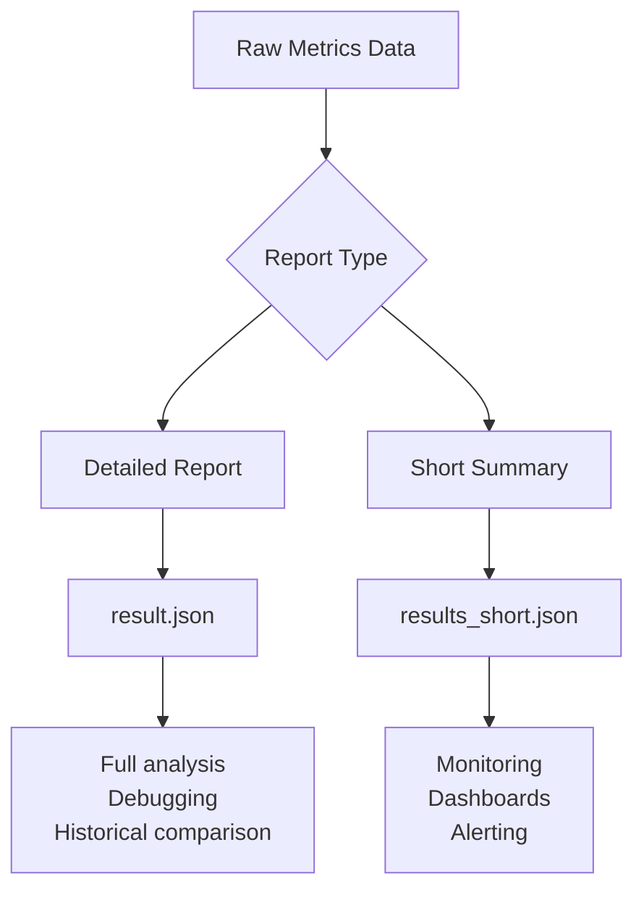
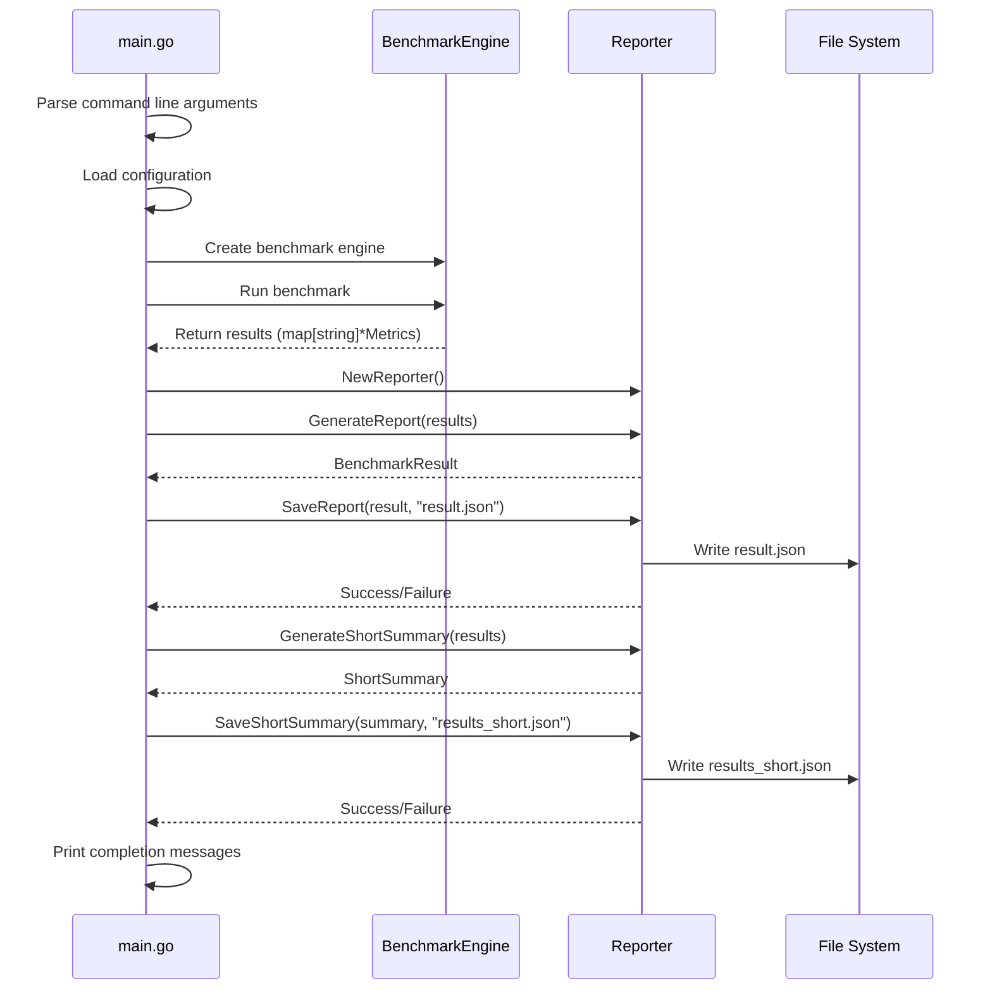
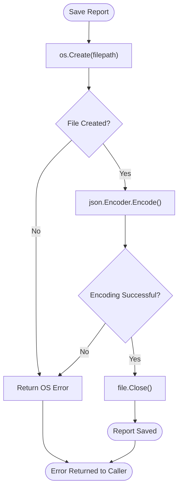

# Report Generation

<cite>
**Referenced Files in This Document**   
- [reporter.go](file://reporter.go)
- [metrics.go](file://metrics.go)
- [main.go](file://main.go)
- [result.json](file://result.json)
- [results_short.json](file://results_short.json)
</cite>

## Table of Contents
1. [Introduction](#introduction)
2. [Core Components](#core-components)
3. [Report Output Formats](#report-output-formats)
4. [Data Structure Definitions](#data-structure-definitions)
5. [Report Generation Workflow](#report-generation-workflow)
6. [Integration and Usage](#integration-and-usage)
7. [Performance Analysis Guidance](#performance-analysis-guidance)
8. [Error Handling](#error-handling)
9. [Extensibility](#extensibility)

## Introduction
The report generation system in the proxy benchmarking tool provides structured JSON output that captures comprehensive performance metrics for each tested proxy. The system produces two distinct output files: `result.json` for detailed analysis with complete timing data, and `results_short.json` for quick summaries suitable for monitoring dashboards. This documentation explains how the Reporter struct consumes finalized Metrics and Statistics data to generate these reports, their structure, usage patterns, and integration possibilities.

## Core Components

The report generation functionality is centered around the `Reporter` struct defined in reporter.go, which orchestrates the transformation of raw benchmark metrics into structured JSON outputs. The system consumes finalized `Metrics` objects containing request, ping, and derived performance data, then formats this information according to two distinct schemas optimized for different use cases.



**Diagram sources**
- [reporter.go](file://reporter.go#L1-L100)
- [metrics.go](file://metrics.go#L8-L45)

**Section sources**
- [reporter.go](file://reporter.go#L1-L100)
- [metrics.go](file://metrics.go#L8-L45)

## Report Output Formats

### Detailed Report (result.json)
The `result.json` file provides a comprehensive breakdown of performance metrics for each proxy, including all individual timing samples, success rates, and statistical analysis. This format is designed for in-depth analysis and debugging, allowing users to examine every aspect of proxy performance.

### Short Summary (results_short.json)
The `results_short.json` file contains an aggregated summary with only the mean response time per proxy. This concise format is optimized for monitoring pipelines, dashboards, and automated alerting systems where minimal data transfer and quick parsing are essential.



**Diagram sources**
- [reporter.go](file://reporter.go#L37-L72)
- [result.json](file://result.json)
- [results_short.json](file://results_short.json)

**Section sources**
- [reporter.go](file://reporter.go#L37-L72)
- [result.json](file://result.json)
- [results_short.json](file://results_short.json)

## Data Structure Definitions

### BenchmarkResult Structure
The `BenchmarkResult` struct defines the schema for the detailed report:

- **timestamp**: ISO 8601 formatted timestamp of when the report was generated
- **proxies**: Array of `ProxyMetrics` objects, one for each tested proxy

### ProxyMetrics Structure
Each proxy entry contains four main components:

- **proxy**: String identifier of the proxy endpoint
- **request_metrics**: Performance data from HTTP request benchmarking
- **ping_metrics**: Network latency measurements
- **derived_metrics**: Processed performance metrics with statistical analysis

### RequestMetrics Fields
- **total**: Total number of requests attempted
- **successful**: Number of successfully completed requests
- **failed**: Number of failed requests
- **times**: Array of individual request durations in milliseconds
- **statistics**: Statistical analysis of the timing data

### Statistics Object
The `Statistics` struct provides mathematical analysis of timing samples:
- **min**: Minimum observed value (int64, ms)
- **max**: Maximum observed value (int64, ms)
- **mean**: Average value (float64, ms)
- **median**: Middle value (float64, ms)
- **std_dev**: Standard deviation (float64, ms)
- **percentiles**: Map of percentile values (e.g., "90.0": 1347.5)

### ShortSummary Structure
The short summary contains:
- **timestamp**: Generation time
- **proxies**: Key-value map where keys are proxy strings and values are mean response times (float64, ms)

**Section sources**
- [reporter.go](file://reporter.go#L8-L29)
- [metrics.go](file://metrics.go#L17-L45)

## Report Generation Workflow

The report generation process follows a clear sequence of operations orchestrated through the main application flow:



**Diagram sources**
- [main.go](file://main.go#L50-L80)
- [reporter.go](file://reporter.go#L37-L98)

**Section sources**
- [main.go](file://main.go#L50-L80)
- [reporter.go](file://reporter.go#L37-L98)

## Integration and Usage

### Writing Reports to Disk
The system automatically generates both report types upon benchmark completion. Users can integrate these outputs into external systems by reading the JSON files:

```go
// Example integration code (not in original source)
func ReadBenchmarkResults() (*BenchmarkResult, *ShortSummary, error) {
    // Read detailed results
    detailedFile, err := os.Open("result.json")
    if err != nil {
        return nil, nil, err
    }
    defer detailedFile.Close()
    
    var detailedResult BenchmarkResult
    if err := json.NewDecoder(detailedFile).Decode(&detailedResult); err != nil {
        return nil, nil, err
    }
    
    // Read short summary
    summaryFile, err := os.Open("results_short.json")
    if err != nil {
        return nil, nil, err
    }
    defer summaryFile.Close()
    
    var shortSummary ShortSummary
    if err := json.NewDecoder(summaryFile).Decode(&shortSummary); err != nil {
        return nil, nil, err
    }
    
    return &detailedResult, &shortSummary, nil
}
```

### Monitoring Pipeline Integration
The `results_short.json` file is particularly well-suited for integration with monitoring tools:

- **Grafana dashboards**: Use the mean values to create time-series visualizations
- **Prometheus exporters**: Convert the JSON to Prometheus metrics format
- **CI/CD pipelines**: Set performance thresholds and fail builds on regressions
- **Alerting systems**: Trigger notifications when mean response times exceed limits

**Section sources**
- [main.go](file://main.go#L65-L80)
- [results_short.json](file://results_short.json)

## Performance Analysis Guidance

### Success Rate Calculation
Success rate is calculated as: `successful / total requests`. This metric indicates proxy reliability and can be found in the `request_metrics.successful` and `request_metrics.total` fields of each proxy entry.

### Detecting Underperforming Proxies
Identify problematic proxies by analyzing:

1. **Latency spikes**: Examine the `max` value compared to `mean` - large differences indicate inconsistent performance
2. **High standard deviation**: Values significantly above zero suggest unstable response times
3. **Percentile analysis**: Compare 90th, 95th, and 99th percentiles to identify outliers
4. **Failure rates**: High `failed` counts relative to `total` indicate connectivity issues

For example, in the sample data, the SOCKS proxy shows significantly higher mean response time (2321ms) compared to HTTP proxies (~1300-1400ms), making it immediately identifiable as underperforming in the short summary.

**Section sources**
- [result.json](file://result.json)
- [results_short.json](file://results_short.json)

## Error Handling

The reporting system implements robust error handling during file operations:

- **File creation errors**: The `SaveReport` and `SaveShortSummary` methods return any `os.Create` errors directly to the caller
- **JSON encoding errors**: Errors from `encoder.Encode()` are propagated upward
- **Caller responsibility**: The main function handles errors by logging fatal messages and terminating execution

This approach follows Go's error propagation pattern, keeping error handling at the appropriate level of abstraction. The system ensures that if report generation fails, the user is notified immediately rather than producing incomplete or missing output files.



**Diagram sources**
- [reporter.go](file://reporter.go#L75-L98)
- [main.go](file://main.go#L70-L75)

**Section sources**
- [reporter.go](file://reporter.go#L75-L98)
- [main.go](file://main.go#L70-L75)

## Extensibility

The current implementation provides a solid foundation for future output format extensions:

- **Additional formats**: Could add CSV, XML, or database export capabilities
- **Custom filtering**: Allow users to specify which metrics to include
- **Threshold-based reporting**: Generate alerts for proxies exceeding performance criteria
- **Historical comparison**: Compare current results against previous benchmarks

The modular design with separate generation and saving methods makes extending the system straightforward while maintaining backward compatibility with existing integrations.

**Section sources**
- [reporter.go](file://reporter.go#L37-L98)