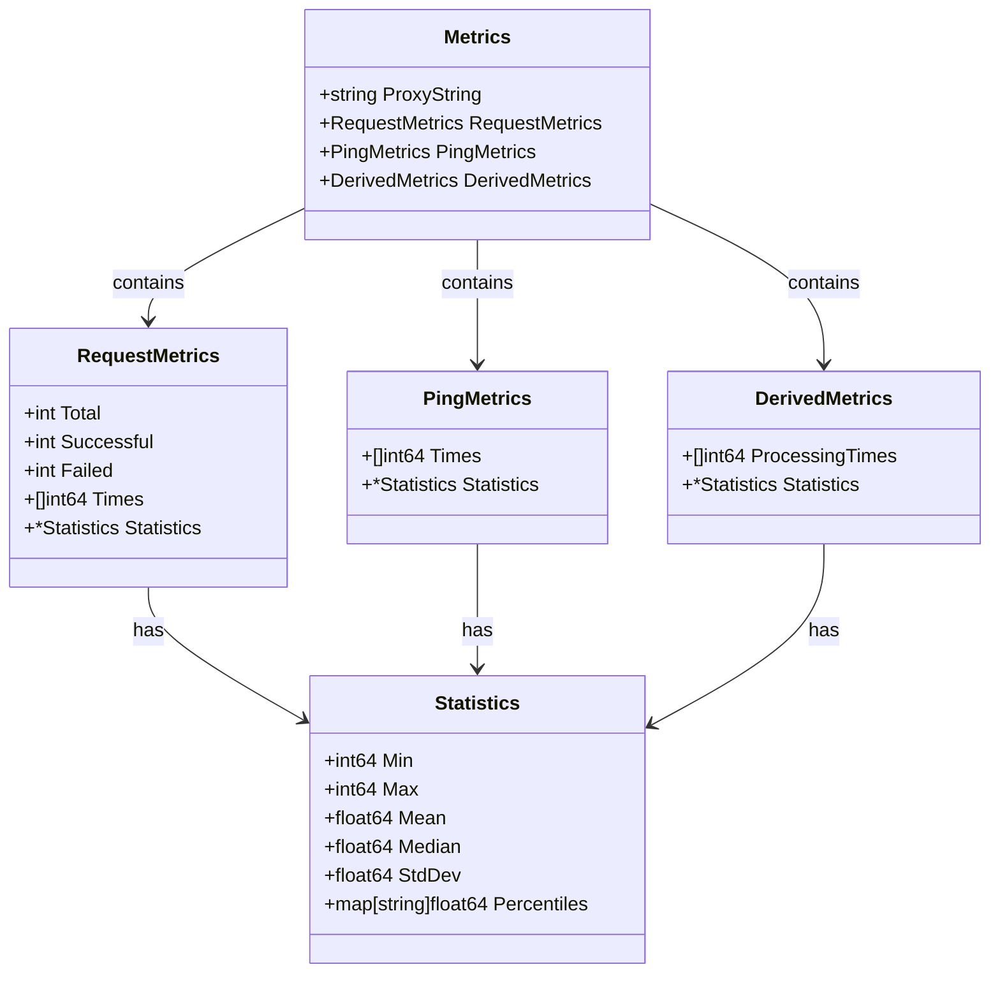
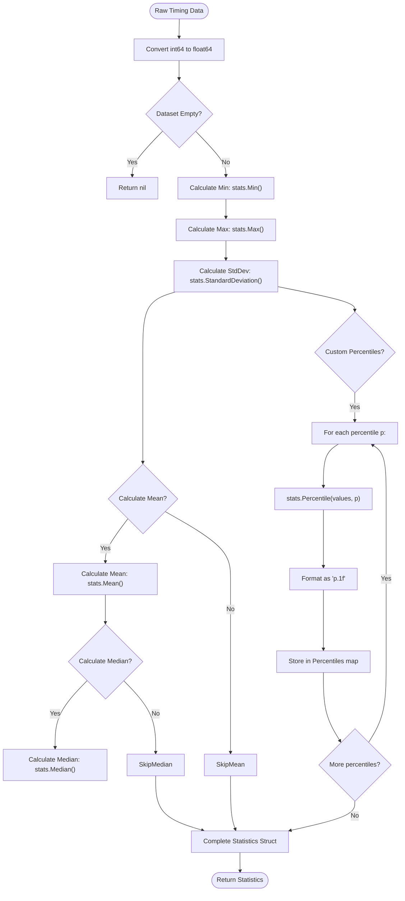
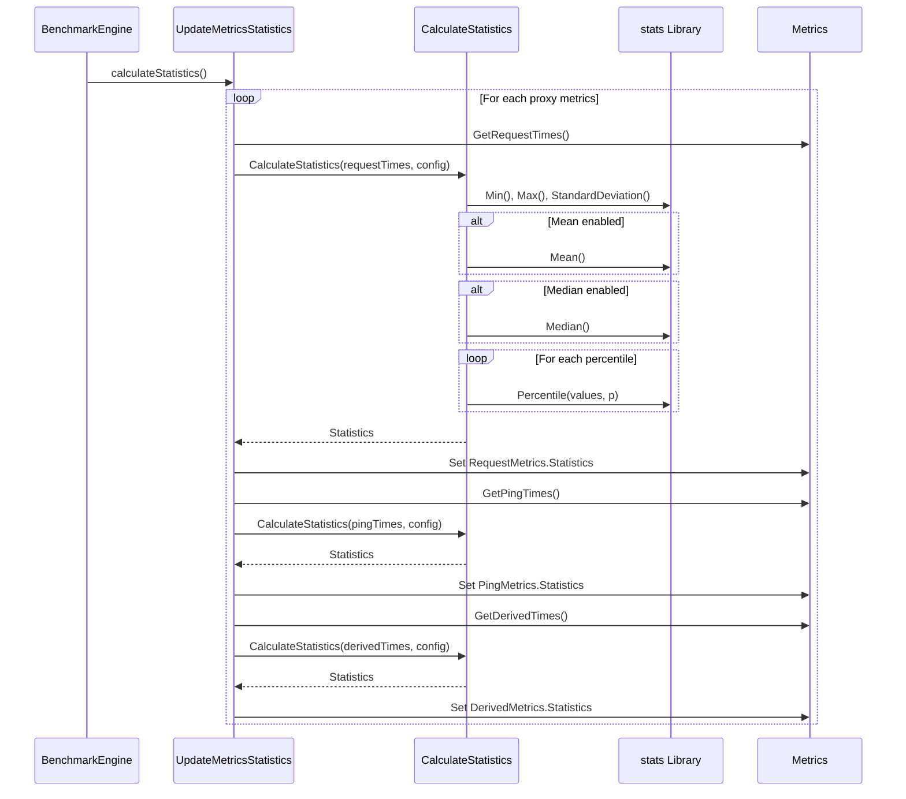
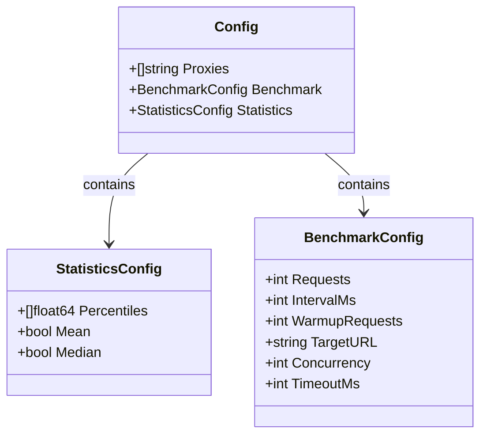
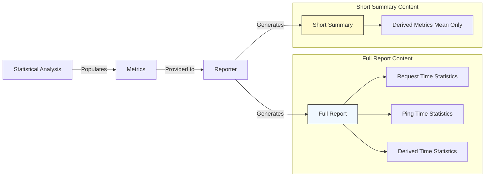

# Statistical Analysis

<cite>
**Referenced Files in This Document**  
- [statistics.go](file://statistics.go)
- [metrics.go](file://metrics.go)
- [benchmark.go](file://benchmark.go)
- [reporter.go](file://reporter.go)
- [config.go](file://config.go)
</cite>

## Table of Contents
1. [Introduction](#introduction)
2. [Statistics Data Model](#statistics-data-model)
3. [Statistical Calculation Process](#statistical-calculation-process)
4. [Data Flow and Integration](#data-flow-and-integration)
5. [Configuration and Customization](#configuration-and-customization)
6. [Edge Case Handling](#edge-case-handling)
7. [Reporting and Usage Context](#reporting-and-usage-context)
8. [Conclusion](#conclusion)

## Introduction

The statistical analysis functionality in the proxy benchmarking system transforms raw timing data into meaningful performance insights through systematic computation of key metrics. By leveraging the `github.com/montanaflynn/stats` library, the system calculates essential statistical measures from request, ping, and derived processing times collected during benchmarking. These calculations enable comprehensive evaluation of proxy reliability, identification of performance outliers, and assessment of overall network quality. The statistical engine operates as a post-processing phase after data collection, converting arrays of millisecond-level timing measurements into structured analytical outputs that support both detailed diagnostics and high-level comparisons.

**Section sources**
- [statistics.go](file://statistics.go#L1-L60)
- [metrics.go](file://metrics.go#L38-L45)

## Statistics Data Model

The core statistical output is encapsulated in the `Statistics` struct, which serves as a container for calculated metrics derived from timing data. This structure includes fundamental measures such as minimum and maximum values (stored as int64), arithmetic mean and median (as float64), standard deviation, and customizable percentile thresholds. The model supports optional inclusion of certain metrics based on configuration, with fields like Mean and Median marked as omitempty in JSON serialization to reduce payload size when not requested. Percentile results are stored in a map with string keys formatted to one decimal place (e.g., "95.0"), allowing flexible representation of various threshold levels while maintaining consistent formatting.

**Diagram sources**
- [metrics.go](file://metrics.go#L22-L45)

**Section sources**
- [metrics.go](file://metrics.go#L38-L45)
- [metrics.go](file://metrics.go#L22-L22)
- [metrics.go](file://metrics.go#L28-L28)
- [metrics.go](file://metrics.go#L34-L34)

## Statistical Calculation Process

The statistical computation pipeline begins with the `CalculateStatistics` function, which accepts raw timing data as int64 values and converts them to float64 format required by the stats library. For empty datasets, the function returns nil to indicate insufficient data, preventing invalid calculations. The process systematically computes minimum and maximum values using `stats.Min()` and `stats.Max()`, followed by standard deviation via `stats.StandardDeviation()`. Conditional logic controls the calculation of mean and median values based on configuration flags, optimizing performance when these metrics are not needed. Percentile calculations are performed iteratively for each configured threshold using `stats.Percentile()`, with results stored in a formatted map for easy retrieval and JSON serialization.

**Diagram sources**
- [statistics.go](file://statistics.go#L8-L53)

**Section sources**
- [statistics.go](file://statistics.go#L8-L53)
- [statistics.go](file://statistics.go#L15-L18)
- [statistics.go](file://statistics.go#L20-L25)
- [statistics.go](file://statistics.go#L27-L32)
- [statistics.go](file://statistics.go#L34-L39)
- [statistics.go](file://statistics.go#L41-L50)

## Data Flow and Integration

Statistical analysis is integrated into the benchmarking workflow through the `UpdateMetricsStatistics` function, which orchestrates the calculation process across all metric categories. This function operates on a `Metrics` instance, extracting timing data for requests, pings, and derived processing times through dedicated accessor methods (`GetRequestTimes`, `GetPingTimes`, `GetDerivedTimes`). Each dataset undergoes independent statistical processing using the shared configuration, ensuring consistent treatment across measurement types. The integration occurs during the final phase of benchmark execution, where the `BenchmarkEngine.calculateStatistics` method invokes `UpdateMetricsStatistics` for every proxy's metrics, populating the statistics fields before reporting.

**Diagram sources**
- [statistics.go](file://statistics.go#L56-L60)
- [benchmark.go](file://benchmark.go#L258-L262)
- [metrics.go](file://metrics.go#L94-L111)

**Section sources**
- [statistics.go](file://statistics.go#L56-L60)
- [benchmark.go](file://benchmark.go#L258-L262)
- [metrics.go](file://metrics.go#L94-L111)

## Configuration and Customization

The statistical analysis behavior is controlled through the `StatisticsConfig` structure, which allows fine-grained customization of calculated metrics. Users can specify an array of percentile thresholds (e.g., 95.0, 99.0) to identify performance outliers at desired confidence levels. Boolean flags enable or disable computation of mean and median values, providing flexibility to balance analytical depth with processing overhead. This configuration is passed through the main `Config` object and applied uniformly across all proxies and metric types during analysis. The design supports selective computation, avoiding unnecessary calculations when specific metrics are not required, thus optimizing performance for large-scale benchmarking operations.

**Diagram sources**
- [config.go](file://config.go#L25-L29)
- [config.go](file://config.go#L11-L11)

**Section sources**
- [config.go](file://config.go#L25-L29)
- [config.go](file://config.go#L11-L11)

## Edge Case Handling

The statistical system implements robust handling of edge cases to ensure reliable operation under various conditions. Empty datasets are gracefully managed by returning nil from `CalculateStatistics`, which prevents downstream processing of invalid results. The conversion from int64 to float64 accommodates the full range of timing values without precision loss, while mutex-protected access to timing arrays ensures thread-safe reading during concurrent benchmark execution. When calculating derived metrics (request time minus twice ping time), negative values are clamped to zero to maintain physical plausibility. The system also handles failed requests by recording zero values for ping times, preserving dataset integrity while marking unsuccessful attempts.

**Section sources**
- [statistics.go](file://statistics.go#L10-L12)
- [metrics.go](file://metrics.go#L94-L101)
- [metrics.go](file://metrics.go#L104-L111)
- [benchmark.go](file://benchmark.go#L230-L233)

## Reporting and Usage Context

Statistical results are consumed by the reporting layer to generate both comprehensive and concise output formats. The `Reporter.GenerateShortSummary` method specifically utilizes the mean value from derived metrics statistics to create a compact performance overview, enabling quick comparison across proxies. Full benchmark reports include complete statistical profiles for all metric categories, providing detailed insights into performance characteristics. These statistics serve multiple purposes: identifying high-latency outliers through percentile analysis, assessing consistency via standard deviation, and evaluating overall responsiveness through mean and median values. The integration between statistical analysis and reporting enables both deep technical analysis and high-level decision-making based on quantified proxy performance.

**Diagram sources**
- [reporter.go](file://reporter.go#L57-L72)

**Section sources**
- [reporter.go](file://reporter.go#L57-L72)
- [reporter.go](file://reporter.go#L38-L55)

## Conclusion

The statistical analysis subsystem provides a critical transformation from raw timing data to actionable performance insights, serving as the analytical foundation of the proxy benchmarking system. By systematically computing key metrics including minimum, maximum, mean, median, standard deviation, and customizable percentiles, it enables comprehensive evaluation of proxy quality and reliability. The modular design separates concerns between data collection, statistical computation, and reporting, while maintaining efficient data flow through well-defined interfaces. Configuration-driven customization allows users to tailor the analysis to their specific needs, balancing detail and performance. This robust statistical framework supports both detailed technical analysis and high-level comparative assessments, making it an essential component for informed decision-making in proxy selection and network performance evaluation.