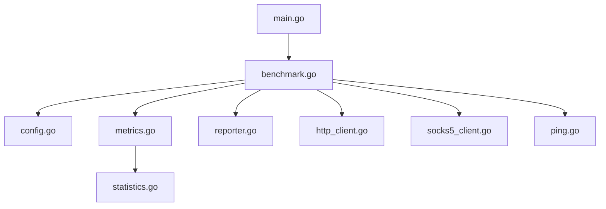
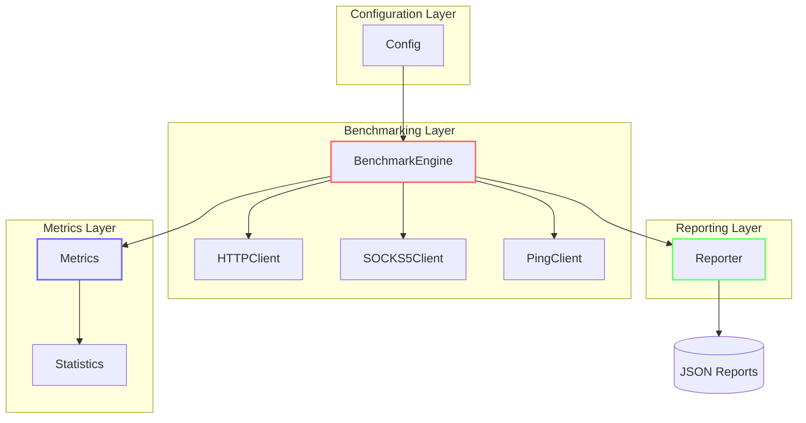
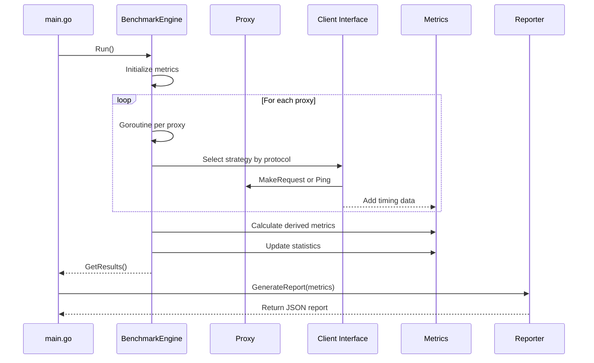
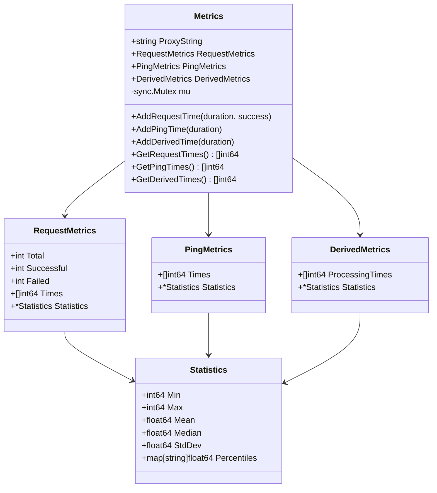
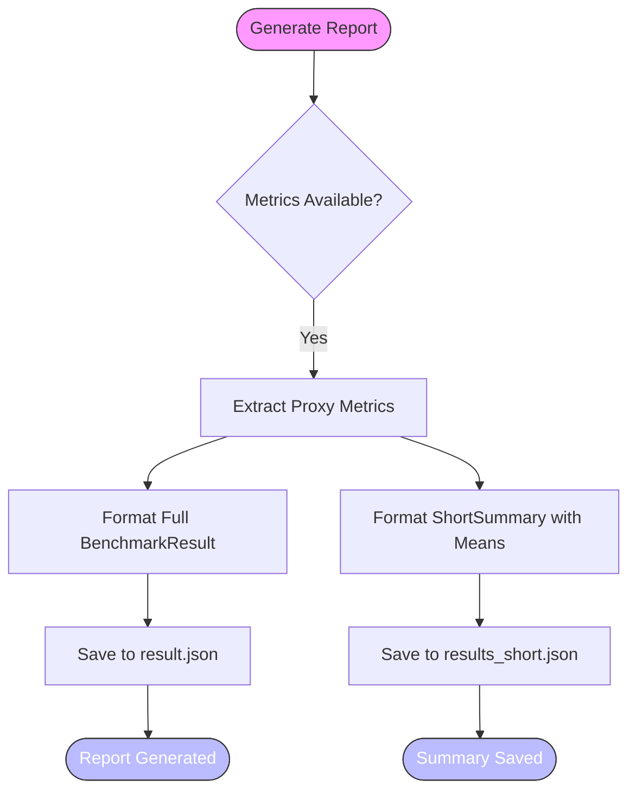
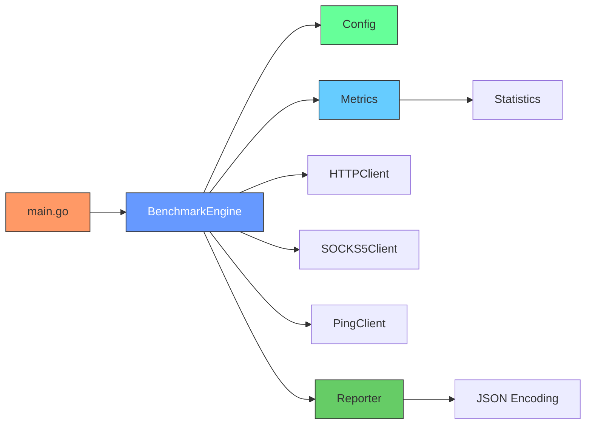

# Technical Architecture

<cite>
**Referenced Files in This Document **   
- [main.go](file://main.go)
- [benchmark.go](file://benchmark.go)
- [config.go](file://config.go)
- [metrics.go](file://metrics.go)
- [reporter.go](file://reporter.go)
- [http_client.go](file://http_client.go)
- [socks5_client.go](file://socks5_client.go)
- [ping.go](file://ping.go)
- [statistics.go](file://statistics.go)
</cite>

## Table of Contents
1. [Introduction](#introduction)
2. [Project Structure](#project-structure)
3. [Core Components](#core-components)
4. [Architecture Overview](#architecture-overview)
5. [Detailed Component Analysis](#detailed-component-analysis)
6. [Dependency Analysis](#dependency-analysis)
7. [Performance Considerations](#performance-considerations)
8. [Troubleshooting Guide](#troubleshooting-guide)
9. [Conclusion](#conclusion)

## Introduction
The proxy-benchmark application is designed to evaluate the performance of multiple proxy servers through a structured benchmarking process. It follows a modular monolith architecture with clearly separated concerns across configuration, benchmarking, metrics collection, and reporting layers. The system leverages established design patterns such as Factory, Strategy, Observer, and Dependency Injection to ensure extensibility, testability, and maintainability. Concurrency is managed using goroutines per proxy and mutex-protected shared state, enabling efficient parallel execution while preserving data integrity.

## Project Structure

**Diagram sources**
- [main.go](file://main.go#L9-L80)
- [benchmark.go](file://benchmark.go#L10-L15)

**Section sources**
- [main.go](file://main.go#L9-L80)
- [benchmark.go](file://benchmark.go#L10-L15)

## Core Components

The core components of the proxy-benchmark system are organized around four primary architectural layers: Configuration, Benchmarking, Metrics, and Reporting. These layers interact in a unidirectional flow from initialization to result generation. The `BenchmarkEngine` orchestrates the entire process by coordinating client creation, executing benchmark phases, collecting metrics, and preparing results for reporting. Each component receives its dependencies explicitly via constructor injection, promoting loose coupling and ease of testing.

**Section sources**
- [benchmark.go](file://benchmark.go#L10-L15)
- [config.go](file://config.go#L8-L12)
- [metrics.go](file://metrics.go#L8-L14)
- [reporter.go](file://reporter.go#L29-L29)

## Architecture Overview

**Diagram sources**
- [benchmark.go](file://benchmark.go#L10-L15)
- [config.go](file://config.go#L8-L12)
- [metrics.go](file://metrics.go#L8-L14)
- [reporter.go](file://reporter.go#L29-L29)

## Detailed Component Analysis

### Benchmark Engine Analysis

The `BenchmarkEngine` serves as the central orchestrator of the benchmarking workflow. It implements the Factory Pattern through `NewBenchmarkEngine`, which parses and validates proxy configurations before instantiation. The engine manages three distinct benchmarking phases—warmup, ping measurement, and request benchmarking—executed sequentially. During each phase, it applies the Strategy Pattern by conditionally selecting the appropriate client implementation based on the proxy protocol (HTTP/HTTPS vs SOCKS5).

**Diagram sources**
- [benchmark.go](file://benchmark.go#L39-L75)
- [http_client.go](file://http_client.go#L17-L36)
- [socks5_client.go](file://socks5_client.go#L16-L40)
- [ping.go](file://ping.go#L15-L19)

**Section sources**
- [benchmark.go](file://benchmark.go#L39-L75)
- [benchmark.go](file://benchmark.go#L78-L91)
- [benchmark.go](file://benchmark.go#L131-L144)
- [benchmark.go](file://benchmark.go#L174-L187)

### Metrics System Analysis

The metrics subsystem employs the Observer Pattern during benchmark phases, where time measurements are observed and recorded asynchronously by each `Metrics` instance. Each proxy has its own `Metrics` object that collects raw timings for requests and pings, then derives processing times by subtracting round-trip network latency. All write operations on metrics are protected by a mutex (`mu`) to ensure thread safety during concurrent access from multiple goroutines.

**Diagram sources**
- [metrics.go](file://metrics.go#L8-L14)
- [metrics.go](file://metrics.go#L48-L61)

**Section sources**
- [metrics.go](file://metrics.go#L8-L122)

### Reporting Layer Analysis

The reporting module uses the Factory Pattern via `NewReporter()` to instantiate a reporter responsible for transforming raw metrics into structured JSON reports. Two output formats are supported: a full `BenchmarkResult` containing detailed statistics per proxy, and a concise `ShortSummary` that includes only mean values. This dual-reporting approach enables both deep analysis and quick comparisons.

**Diagram sources**
- [reporter.go](file://reporter.go#L37-L54)
- [reporter.go](file://reporter.go#L57-L72)
- [reporter.go](file://reporter.go#L75-L85)

**Section sources**
- [reporter.go](file://reporter.go#L37-L85)

## Dependency Analysis

**Diagram sources**
- [main.go](file://main.go#L9-L80)
- [benchmark.go](file://benchmark.go#L10-L15)
- [config.go](file://config.go#L8-L12)
- [metrics.go](file://metrics.go#L8-L14)
- [reporter.go](file://reporter.go#L29-L29)

**Section sources**
- [main.go](file://main.go#L9-L80)
- [benchmark.go](file://benchmark.go#L10-L15)

## Performance Considerations

The concurrency model utilizes one goroutine per proxy during each benchmark phase, allowing parallel execution without blocking. Shared state in `Metrics` is protected by mutexes rather than channels, favoring simplicity and direct control over communication complexity. While this choice increases contention risk under high concurrency, the current design assumes moderate numbers of proxies and intervals between requests, making mutex overhead acceptable. The use of Go's native sync primitives aligns with the project’s goal of readability and maintainability over maximum throughput.

The decision to use JSON for configuration and reporting enhances interoperability and human-readability, facilitating integration with external tools and manual inspection. Although binary formats could reduce I/O size, JSON was selected for its ubiquity and ease of debugging in operational contexts.

**Section sources**
- [benchmark.go](file://benchmark.go#L78-L91)
- [metrics.go](file://metrics.go#L13-L13)
- [main.go](file://main.go#L9-L80)

## Troubleshooting Guide

Common issues typically arise from invalid proxy configurations, network timeouts, or unsupported protocols. The application logs warnings when parsing invalid proxies and skips them gracefully. Timeouts are configurable via `timeout_ms` in the config file, and increasing this value may resolve transient connectivity issues. Protocol support is limited to "http", "https", and "socks"—any other values will trigger an unsupported protocol warning.

When benchmark results show consistently high latencies or failures, verify:
- Proxy credentials and addresses
- Network reachability to proxy endpoints
- Target URL accessibility
- Sufficient timeout settings relative to network conditions

Logs are printed directly to stdout with contextual messages indicating phase progression and errors, aiding real-time diagnosis.

**Section sources**
- [benchmark.go](file://benchmark.go#L39-L75)
- [proxy.go](file://proxy.go#L18-L32)
- [main.go](file://main.go#L9-L80)

## Conclusion

The proxy-benchmark system exemplifies a well-structured modular monolith with clear separation of concerns and thoughtful application of design patterns. Its architecture balances performance, correctness, and maintainability through strategic use of concurrency, dependency injection, and layered abstraction. By adhering to Go idioms and prioritizing code clarity, the system remains accessible for extension and adaptation to new benchmarking requirements.