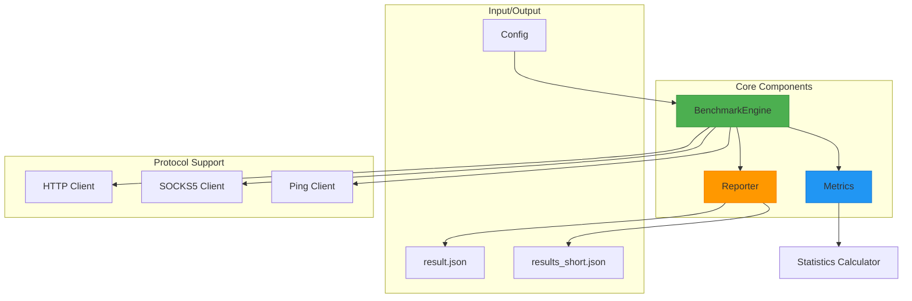
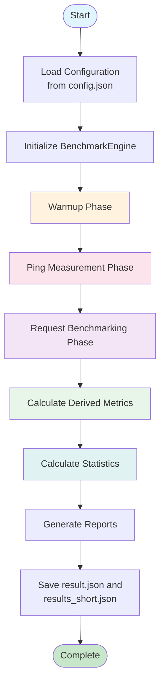
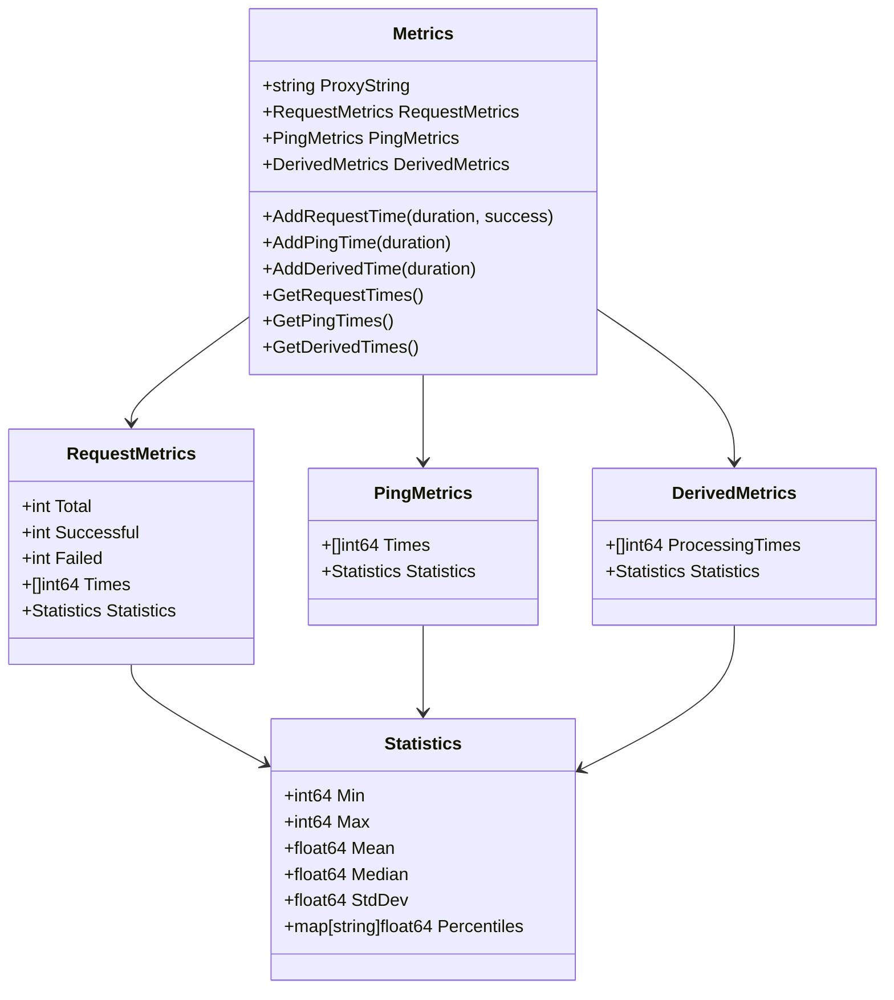

# Tool Overview & Core Value

<cite>
**Referenced Files in This Document**   
- [main.go](file://main.go)
- [config.go](file://config.go)
- [benchmark.go](file://benchmark.go)
- [metrics.go](file://metrics.go)
- [reporter.go](file://reporter.go)
- [config.example.json](file://config.example.json)
</cite>

## Table of Contents
1. [Introduction](#introduction)
2. [Core Architecture](#core-architecture)
3. [Key Features](#key-features)
4. [Benchmarking Workflow](#benchmarking-workflow)
5. [Metrics and Statistical Analysis](#metrics-and-statistical-analysis)
6. [Report Generation](#report-generation)
7. [Configuration System](#configuration-system)
8. [Use Cases](#use-cases)

## Introduction

The proxy-benchmark CLI tool is a Go-based utility designed for measuring and analyzing proxy server performance across HTTP, HTTPS, and SOCKS5 protocols. It enables developers and network engineers to evaluate latency, request response times, and derived processing metrics with statistical rigor. The tool's core value proposition lies in its ability to provide comprehensive performance insights through a structured benchmarking process that isolates network latency from actual proxy processing time.

Built around the **BenchmarkEngine**, the tool orchestrates a multi-phase testing approach that begins with configuration loading and ends with detailed JSON report generation. It supports concurrent testing of multiple proxies, making it efficient for comparing different proxy providers or validating internal infrastructure. The integration-ready design allows seamless incorporation into automated testing and monitoring pipelines, providing consistent performance evaluation across environments.

## Core Architecture

The proxy-benchmark tool follows a modular architecture centered around key components that handle specific aspects of the benchmarking process. At its heart is the **BenchmarkEngine**, which coordinates all phases of the benchmark execution. The engine works in conjunction with specialized components for metrics collection (**Metrics**), statistical analysis, and reporting (**Reporter**).



**Diagram sources**
- [benchmark.go](file://benchmark.go#L10-L15)
- [metrics.go](file://metrics.go#L8-L14)
- [reporter.go](file://reporter.go#L29-L29)

**Section sources**
- [main.go](file://main.go#L0-L81)
- [benchmark.go](file://benchmark.go#L0-L276)

## Key Features

### Multi-Protocol Support
The tool supports three major proxy protocols: HTTP, HTTPS, and SOCKS5. Each protocol is handled by dedicated client implementations that ensure proper connection handling and authentication. The **ParseProxy** function validates proxy strings and routes them to appropriate clients based on their protocol specification.

### Warmup Phase
Before formal benchmarking begins, the tool executes a warmup phase to establish stable connections with each proxy. This ensures that initial connection overhead does not skew performance measurements. The number of warmup requests is configurable through the `warmup_requests` parameter.

### Ping Measurement
The tool measures raw TCP connection time to proxy servers using direct ping operations. This metric represents pure network latency between the client and proxy server, serving as a baseline for calculating derived processing metrics.

### Request Benchmarking
Actual HTTP/HTTPS requests are made through each proxy to a configurable target URL. The tool records total request time, success/failure status, and other performance indicators. Concurrency is managed through goroutines, allowing simultaneous testing of multiple proxies.

### Derived Metrics Calculation
A unique feature of this tool is its calculation of derived processing metrics. By subtracting twice the ping time (accounting for round-trip network latency) from the total request time, the tool estimates the actual processing time spent by the proxy server itself.

**Section sources**
- [benchmark.go](file://benchmark.go#L78-L91)
- [benchmark.go](file://benchmark.go#L131-L144)
- [benchmark.go](file://benchmark.go#L174-L187)
- [benchmark.go](file://benchmark.go#L240-L255)

## Benchmarking Workflow

The benchmarking process follows a structured sequence of phases, ensuring accurate and reliable performance measurements. This workflow is orchestrated by the **BenchmarkEngine.Run** method, which executes each phase in a predetermined order.



**Diagram sources**
- [main.go](file://main.go#L0-L81)
- [benchmark.go](file://benchmark.go#L39-L75)

**Section sources**
- [benchmark.go](file://benchmark.go#L39-L75)
- [benchmark.go](file://benchmark.go#L258-L262)

## Metrics and Statistical Analysis

The tool collects and analyzes several categories of metrics, providing both raw measurements and statistically processed data. All metrics are stored in the **Metrics** structure, which organizes data by proxy and measurement type.

### Primary Metrics
- **Request Metrics**: Total request count, successful/failed counts, and individual request durations
- **Ping Metrics**: Direct TCP connection times to proxy servers
- **Derived Metrics**: Estimated proxy processing time calculated as (request time - 2×ping time)

### Statistical Calculations
For each metric category, the tool calculates:
- Minimum and maximum values
- Mean (average) when enabled in configuration
- Median when enabled in configuration
- Standard deviation
- Custom percentiles (P90, P95, P99, etc.) as specified in configuration
- Success rate percentage

The **UpdateMetricsStatistics** function processes raw timing data and generates comprehensive statistical summaries that help identify performance characteristics and outliers.



**Diagram sources**
- [metrics.go](file://metrics.go#L8-L14)
- [metrics.go](file://metrics.go#L48-L61)

**Section sources**
- [metrics.go](file://metrics.go#L0-L122)
- [statistics.go](file://statistics.go#L56-L60)

## Report Generation

The reporting system produces two complementary output files that serve different analytical purposes. The **Reporter** component handles both report generation and file output operations.

### Detailed Report (result.json)
The primary output file contains comprehensive benchmark results with full metric details for each proxy. This includes:
- Timestamp of benchmark execution
- Complete request timing data
- Ping measurement results
- Derived processing times
- Statistical summaries for all metrics
- Success/failure counts

### Short Summary (results_short.json)
A condensed version containing only essential summary statistics, particularly the mean values for quick comparison. This format is ideal for automated systems that need to track performance trends over time without processing large datasets.

The **GenerateReport** and **GenerateShortSummary** methods create these outputs, while **SaveReport** and **SaveShortSummary** handle file persistence with formatted JSON output.

**Section sources**
- [reporter.go](file://reporter.go#L0-L99)
- [reporter.go](file://reporter.go#L37-L54)
- [reporter.go](file://reporter.go#L75-L85)

## Configuration System

The tool uses a JSON-based configuration system that allows extensive customization of benchmark parameters. The **LoadConfig** function reads settings from a configuration file, applying sensible defaults when values are omitted.

### Configuration Structure
```json
{
  "proxies": ["protocol:host:port:username:password:status"],
  "benchmark": {
    "requests": 100,
    "interval_ms": 5000,
    "warmup_requests": 10,
    "target_url": "https://httpbin.org/get",
    "concurrency": 10,
    "timeout_ms": 30000
  },
  "statistics": {
    "percentiles": [90, 95, 99],
    "mean": true,
    "median": true
  }
}
```

Key configuration options include request count, interval between requests, warmup requests, target URL, concurrency level, timeout duration, and statistical calculations to perform.

**Section sources**
- [config.go](file://config.go#L0-L48)
- [config.go](file://config.go#L32-L47)
- [config.example.json](file://config.example.json#L0-L19)

## Use Cases

### Commercial Proxy Provider Comparison
Developers can use the tool to objectively compare performance across different commercial proxy providers. By running identical benchmarks against multiple services, they can make data-driven decisions about which provider offers the best performance for their specific use case.

### Internal Infrastructure Validation
Network engineers can validate the performance of internal proxy infrastructure, identifying bottlenecks or degradation over time. Regular benchmarking helps ensure that proxy servers meet service level agreements and performance requirements.

### Geographic Performance Testing
The tool can measure how proxy performance varies across different geographic locations, helping organizations optimize their proxy selection based on user distribution.

### Continuous Monitoring Integration
Due to its structured JSON output and command-line interface, the tool integrates seamlessly into CI/CD pipelines and monitoring systems. Automated benchmarks can trigger alerts when performance falls below acceptable thresholds.

### Load Pattern Analysis
By adjusting concurrency and interval settings, users can simulate different load patterns and observe how proxies respond under various conditions, helping to identify scalability limits.

**Section sources**
- [README.md](file://README.md#L0-L332)
- [main.go](file://main.go#L0-L81)